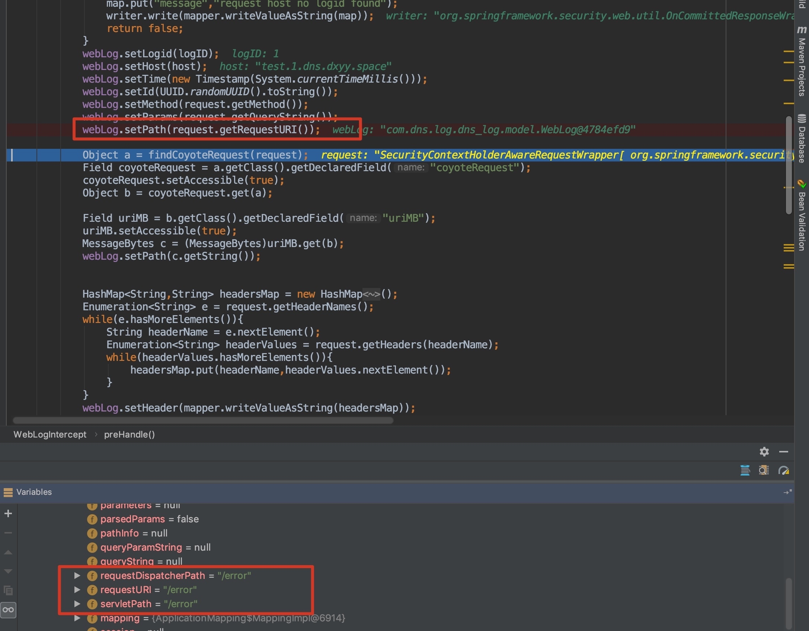
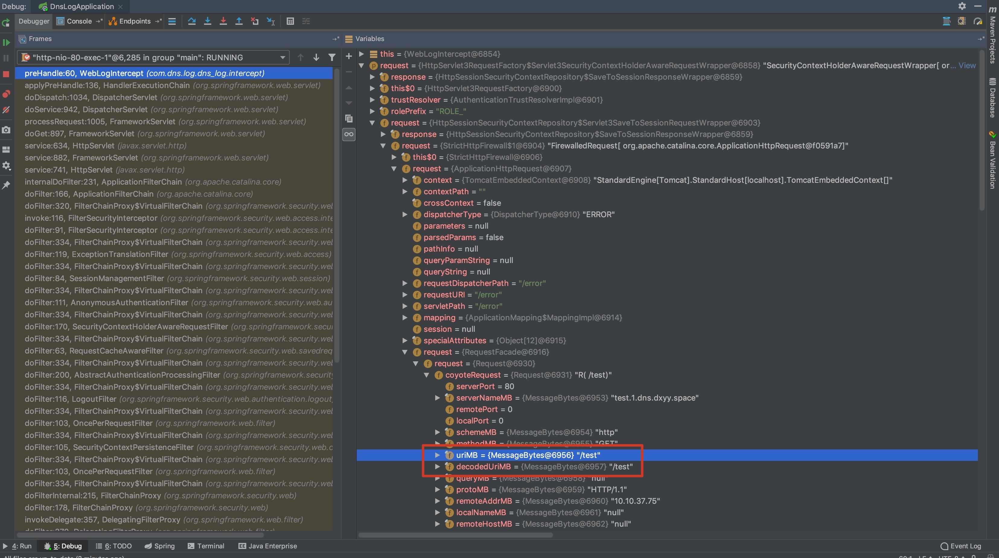
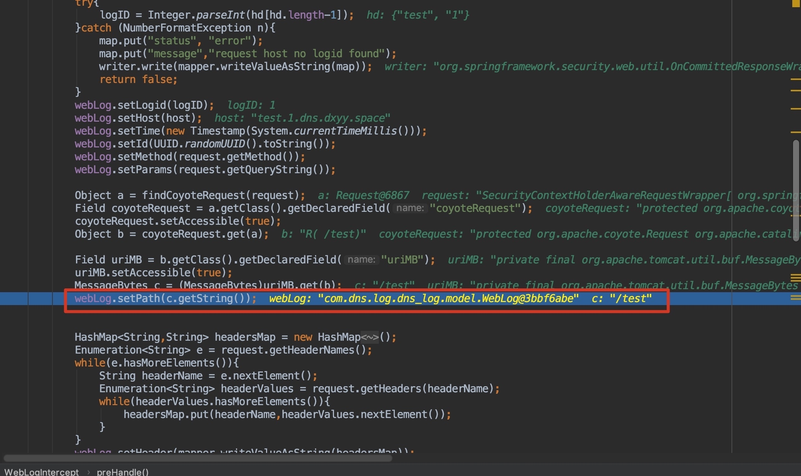

# SpringBoot+SpringSecurity getRequestURI()返回/error问题

以前简书上的文挪到git

请求http://test.com/test 进行测试

使用request.getRequestURI()方法获取请求路径时发现如果请求的路由不存在，那么requestDispatcherPath/requestURI/servletPath的value都是/error而不是/test

调试可以发现真实的path在org.apache.coyote.Request的uriMb字段中

获取使用如下方法uriMb字段内容
```java
//根据Field获得对应的Class
private Class getClassByName(Class classObject, String name){
    Map<Class,List<Field>> fieldMap = new HashMap<>();
    Class returnClass = null;
    Class tempClass = classObject;
    while (tempClass != null) {
        fieldMap.put(tempClass,Arrays.asList(tempClass .getDeclaredFields()));
        tempClass = tempClass.getSuperclass();
    }
    
    for(Map.Entry<Class,List<Field>> entry: fieldMap.entrySet()){
        for (Field f : entry.getValue()) {
            if(f.getName().equals(name)){
                returnClass = entry.getKey();
                break;
            }
        }
    }
    return returnClass;
}

//递归遍历父类寻找coyoteRequest Field   
private Object findCoyoteRequest(Object request)  throws Exception {
    Class a = getClassByName(request.getClass(),"request");
    Field request1 = a.getDeclaredField("request");
    request1.setAccessible(true);
    Object b = request1.get(request);
    if(getClassByName(b.getClass(),"coyoteRequest") == null){
        return findCoyoteRequest(b);
    }else{
        return b;
        }
    }
```
通过上述代码可以获取到包含coyoteRequest的Object
每一层的调用顺序如下：
```
org.springframework.security.web.servletapi.HttpServlet3RequestFactory$Servlet3SecurityContextHolderAwareRequestWrapper
org.springframework.security.web.context.HttpSessionSecurityContextRepository$Servlet3SaveToSessionRequestWrapper
org.springframework.security.web.firewall.StrictHttpFirewall$1
org.apache.catalina.core.ApplicationHttpRequest
org.apache.catalina.connector.RequestFacade
org.apache.catalina.connector.Request
org.apache.coyote.Request
```
获取uriMB的代码
```java
Object a = findCoyoteRequest(request);
Field coyoteRequest = a.getClass().getDeclaredField("coyoteRequest");
coyoteRequest.setAccessible(true);
Object b = coyoteRequest.get(a);

Field uriMB = b.getClass().getDeclaredField("uriMB");
uriMB.setAccessible(true);
MessageBytes c = (MessageBytes)uriMB.get(b);
System.out.println(c.getString());
```
c.getString()即为uriMB的value

